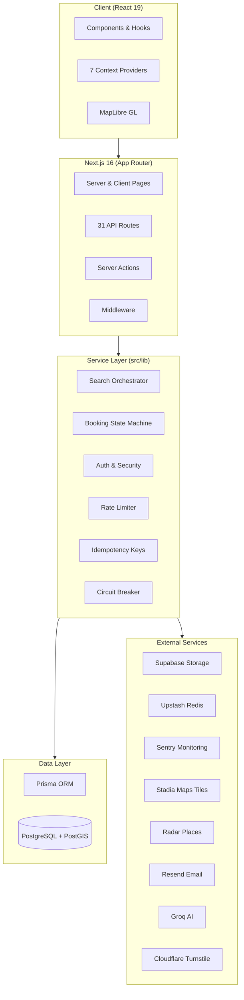

# Roomshare

A production room-sharing and rental platform built with **trust, safety, and reliability** as core values. Roomshare connects hosts with guests through a full-featured search experience, booking lifecycle management, real-time messaging, and a comprehensive admin panel.

## Architecture



## Tech Stack

| Layer | Technology |
|---|---|
| Framework | Next.js 16 (App Router), React 19 |
| Database | PostgreSQL + PostGIS via Prisma ORM v6 |
| Auth | NextAuth v5 (email/password + Google OAuth) |
| Maps | MapLibre GL, react-map-gl, Stadia Maps tiles |
| Storage | Supabase |
| Cache / Rate Limiting | Upstash Redis (DB fallback) |
| Monitoring | Sentry (client + server + edge) |
| AI | Vercel AI SDK with Groq + OpenAI |
| Styling | Tailwind CSS 4 |
| UI | Radix UI, Lucide icons, Framer Motion |
| Validation | Zod 4 |
| CAPTCHA | Cloudflare Turnstile |
| Nearby Places | Radar API |
| Email | Resend |
| Testing | Jest 30, Playwright, Testing Library, fast-check |

## Features

- **Search with Map** -- Full-text search with interactive map, 10+ filter types, faceted results, natural language parsing, cursor-based pagination, near-match suggestions, and split-stay matching
- **Listings** -- Create, edit, view, and manage listings with multi-image upload, status toggling (Active/Paused/Rented), and privacy-circle location display
- **Bookings** -- Server-validated booking state machine (Pending/Accepted/Rejected/Cancelled) with idempotency keys, optimistic locking, and race-safe transitions
- **Messaging** -- Real-time messaging between hosts and guests with user blocking, soft delete, typing indicators, and unread counts
- **AI Chatbot** -- Neighborhood intelligence chatbot powered by Groq for local area information
- **User Profiles** -- Profile completion tracking, avatar upload, verification requests, and account settings
- **Reviews** -- Review cards with host responses, one-review-per-listing enforcement
- **Favorites & Saved Searches** -- Save listings and create search alerts with configurable frequency (instant/daily/weekly)
- **Admin Panel** -- Dashboard with immutable audit logs, listing management, user suspension, report resolution, and identity verifications
- **Auth** -- Email/password with bcrypt hashing, email verification, password reset, Google OAuth, and Turnstile CAPTCHA
- **Rate Limiting** -- Dual-layer system: Upstash Redis primary with database fallback for serverless compatibility
- **Nearby Places** -- Radar-powered points of interest near listings
- **Health Monitoring** -- Liveness and readiness probes, metrics endpoints, Web Vitals tracking, circuit breaker patterns
- **Offline Support** -- Service worker with offline fallback page
- **Reporting** -- User reporting system with admin review workflow (Open/Resolved/Dismissed)

## Documentation

| Document | Description |
|---|---|
| [Architecture](docs/ARCHITECTURE.md) | System design, layer boundaries, data flow diagrams |
| [API Reference](docs/API_REFERENCE.md) | All 31 API endpoints with schemas and examples |
| [Database](docs/DATABASE.md) | Schema, ERD, 24 models, migration guide |
| [Search System](docs/SEARCH_SYSTEM.md) | Search architecture, ranking, filters, pagination |
| [State Machines](docs/STATE_MACHINES.md) | Booking, listing, report, and verification lifecycles |
| [Components](docs/COMPONENTS.md) | Component catalog, hooks, contexts, UI library |
| [Security](docs/SECURITY.md) | Auth flows, rate limiting, PII protection, CAPTCHA |
| [Deployment](docs/DEPLOYMENT.md) | Vercel deployment, env vars, cron jobs |
| [Monitoring](docs/MONITORING.md) | Sentry, health probes, metrics, logging |
| [Testing](docs/TESTING.md) | Test strategy, Jest/Playwright setup, coverage |
| [Contributing](CONTRIBUTING.md) | Dev setup, code style, PR checklist |
| [Troubleshooting](docs/TROUBLESHOOTING.md) | Common issues and debugging guides |

## Project Structure

```
src/
  app/              # Next.js App Router pages (20+ routes) and API routes (31 endpoints)
    api/            # RESTful API: auth, listings, search, messages, reviews, health, cron
    admin/          # Admin panel: audit logs, listings, reports, users, verifications
    search/         # Search page with map + list view
    listings/       # Listing CRUD pages
    messages/       # Messaging interface
    bookings/       # Booking management
  components/       # ~150 React components organized by domain
    ui/             # Base UI library (Radix-based: button, dialog, select, etc.)
    search/         # Search UI: filters, results, bottom sheet, category tabs
    map/            # Map: markers, popups, boundary layers, privacy circles
    listings/       # Listing cards, carousels, image uploaders
    chat/           # Chat window, nearby places cards
    filters/        # Filter chips and applied filter display
    auth/           # Turnstile widget, password modal
  hooks/            # 15 custom hooks (filters, debouncing, rate limits, media queries)
  contexts/         # 7 React contexts (filters, map bounds, search data, focus)
  lib/              # Business logic and services
    search/         # Search engine: v2 service, orchestrator, ranking, NLP parser
    errors/         # Structured error types
    geo/            # Distance calculations
    geocoding/      # Photon + Nominatim geocoding
    maps/           # Map adapter, marker utils, tile config
    places/         # Neighborhood cache and types
    validation/     # Input validation utilities
  types/            # TypeScript type definitions
  styles/           # Global CSS styles
prisma/             # Prisma schema (24 models) and 21 migrations
tests/e2e/          # Playwright E2E test suites
scripts/            # Seed scripts and utilities
public/             # Static assets, map styles, service worker
```

## Getting Started

### Prerequisites

- **Node.js** 18+
- **pnpm** (package manager)
- **PostgreSQL** with PostGIS extension
- **Redis** (optional -- falls back to database rate limiting)

### Quick Start

```bash
# 1. Install dependencies
pnpm install

# 2. Set up environment
cp .env.example .env
# Fill in required values (see docs/DEPLOYMENT.md for details)

# 3. Start PostgreSQL (via Docker or local install)
docker compose up -d

# 4. Run database migrations
npx prisma migrate dev

# 5. Start development server
pnpm dev
```

Open [http://localhost:3000](http://localhost:3000) in your browser.

See [CONTRIBUTING.md](CONTRIBUTING.md) for the full development setup guide and [docs/DEPLOYMENT.md](docs/DEPLOYMENT.md) for production deployment.

## Scripts

| Command | Description |
|---|---|
| `pnpm dev` | Start development server |
| `pnpm build` | Production build |
| `pnpm start` | Start production server |
| `pnpm lint` | Run ESLint |
| `pnpm typecheck` | Run TypeScript type checking |
| `pnpm test` | Run all unit tests (Jest) |
| `pnpm test:coverage` | Run tests with coverage report |
| `pnpm test:unit` | Run unit tests only (lib, hooks, utils) |
| `pnpm test:api` | Run API route tests |
| `pnpm test:components` | Run component tests |
| `pnpm test:filters:all` | Run full filter test suite (schema + integration + property + e2e + perf) |
| `pnpm test:e2e` | Run Playwright E2E tests (seeds DB, cleans locks) |
| `pnpm test:e2e:ui` | Run E2E tests with Playwright UI mode |
| `pnpm test:e2e:headed` | Run E2E tests in headed browser |
| `pnpm test:e2e:debug` | Run E2E tests in debug mode |

See [docs/TESTING.md](docs/TESTING.md) for the full testing guide.

## Security

Roomshare enforces defense-in-depth security:

- **Authentication**: NextAuth v5 with bcrypt password hashing, email verification, and Google OAuth
- **CAPTCHA**: Cloudflare Turnstile on auth forms
- **Rate Limiting**: Dual-layer (Redis + DB fallback) per-endpoint throttling
- **Input Validation**: Zod schemas on all API inputs, server-side only
- **PII Protection**: No raw PII in logs, HMAC hashing for metrics
- **Admin Audit Trail**: Immutable append-only audit log for all admin actions
- **User Safety**: User blocking, content reporting, fair housing compliance

See [docs/SECURITY.md](docs/SECURITY.md) for full details.

## License

Private -- all rights reserved.
