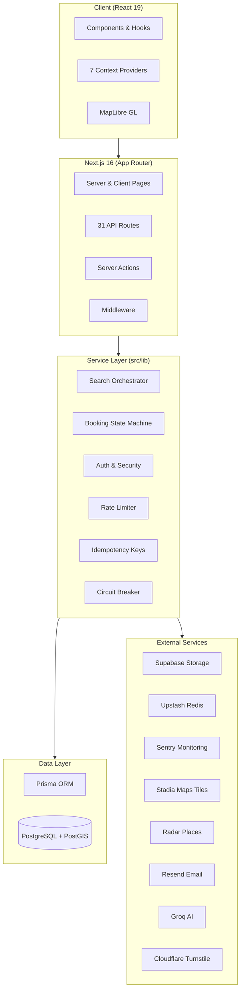

# Roomshare

A production room-sharing and rental platform built with **trust, safety, and reliability** as core values. Roomshare connects hosts with guests through a full-featured search experience, booking lifecycle management, real-time messaging, and a comprehensive admin panel.

## Architecture


```mermaid
graph TB
    subgraph Client["Client (React 19)"]
        UI[Components & Hooks]
        Contexts[7 Context Providers]
        MapGL[MapLibre GL]
    end

    subgraph NextJS["Next.js 16 (App Router)"]
        Pages[Server & Client Pages]
        API[31 API Routes]
        Actions[Server Actions]
        MW[Middleware]
    end

    subgraph Services["Service Layer (src/lib)"]
        Search[Search Orchestrator]
        Booking[Booking State Machine]
        Auth[Auth & Security]
        RateLimit[Rate Limiter]
        Idempotency[Idempotency Keys]
        Circuit[Circuit Breaker]
    end

    subgraph Data["Data Layer"]
        Prisma[Prisma ORM]
        PG[(PostgreSQL + PostGIS)]
    end

    subgraph External["External Services"]
        Supabase[Supabase Storage]
        Redis[Upstash Redis]
        Sentry[Sentry Monitoring]
        Stadia[Stadia Maps Tiles]
        Radar[Radar Places]
        Resend[Resend Email]
        Groq[Groq AI]
        Turnstile[Cloudflare Turnstile]
    end

    Client --> NextJS
    NextJS --> Services
    Services --> Data
    Services --> External
```

## Tech Stack

| Layer                 | Technology                                       |
| --------------------- | ------------------------------------------------ |
| Framework             | Next.js 16 (App Router), React 19                |
| Database              | PostgreSQL + PostGIS via Prisma ORM v6           |
| Auth                  | NextAuth v5 (email/password + Google OAuth)      |
| Maps                  | MapLibre GL, react-map-gl, Stadia Maps tiles     |
| Storage               | Supabase                                         |
| Cache / Rate Limiting | Upstash Redis (DB fallback)                      |
| Monitoring            | Sentry (client + server + edge)                  |
| AI                    | Vercel AI SDK with Groq + OpenAI                 |
| Styling               | Tailwind CSS 4                                   |
| UI                    | Radix UI, Lucide icons, Framer Motion            |
| Validation            | Zod 4                                            |
| CAPTCHA               | Cloudflare Turnstile                             |
| Nearby Places         | Radar API                                        |
| Email                 | Resend                                           |
| Testing               | Jest 30, Playwright, Testing Library, fast-check |

## Core Product Features

- **Authentication and account recovery** -- Email/password auth, Google OAuth, email verification, password reset, and CAPTCHA-protected signup/login flows
- **Listings lifecycle** -- Create, edit, publish, pause, rent, and manage listings with image upload, pricing, amenities, and privacy-aware map display
- **Search and discovery** -- Interactive map search with faceted filters, cursor pagination, natural-language parsing, near matches, split-stay matching, and list/map focus sync
- **Bookings workflow** -- Server-enforced booking lifecycle with validation, idempotency, optimistic locking, and capacity-safe transitions
- **Messaging** -- Direct host/guest messaging with unread counts, blocking controls, and conversation management
- **Profiles and trust signals** -- User profiles, completion prompts, verification flows, reviews, ratings, and host responses
- **Favorites, saved searches, and alerts** -- Saved listings plus recurring search alerts and notification preferences
- **Neighborhood intelligence** -- Nearby places, neighborhood maps, and AI-powered local-area assistance
- **Trust and safety** -- Reporting, suspension enforcement, moderation workflows, and admin review queues
- **Admin operations** -- Admin dashboards for listings, reports, users, verifications, and audit logging
- **Reliability and operations** -- Health probes, metrics, background jobs, rate limiting, offline support, and observability

## Stability-Critical Features

These are the features that matter most when judging whether the app is stable. If these areas are healthy, most of the product is healthy because they cover the primary user journey, trust/safety controls, and operational backbone.

| Stability-Critical Feature | Why It Is Critical |
| --- | --- |
| **1. Authentication, signup, and recovery** | If users cannot sign up, log in, verify email, or reset passwords, nothing else in the app matters. This is the gateway to every protected flow. |
| **2. Listing creation and listing management** | Hosts need to create, edit, and manage listings reliably. If listing CRUD or image upload breaks, supply disappears and search quality collapses. |
| **3. Search, filters, and map discovery** | Search is the main discovery engine of the product. Broken filters, bad pagination, or unstable map/list sync make the marketplace feel unusable even if data still exists. |
| **4. Booking lifecycle and slot safety** | Booking logic is one of the most correctness-sensitive areas in the codebase. It must prevent invalid transitions, race conditions, double-booking, and stale state. |
| **5. Messaging between guests and hosts** | Once discovery works, messaging is the next core conversion step. If conversations fail, users cannot coordinate tours, confirm interest, or resolve booking details. |
| **6. Reviews, profiles, and verification signals** | Trust is central to Roomshare. Ratings, profile completeness, and verification state help users decide whether a person or listing is credible. |
| **7. Favorites, saved searches, and notifications** | These keep users engaged after the first session. If they fail, the app becomes much weaker as a repeat-use marketplace product. |
| **8. Reporting, blocking, suspension, and moderation** | These are the safety valves of the platform. If moderation features are unstable, abuse handling and policy enforcement break down quickly. |
| **9. Admin panel and audit trail** | Admin tooling is how the team resolves problems in production. If the backoffice is unstable, operational response slows down even when the public app still works. |
| **10. Nearby places and neighborhood intelligence** | This is a meaningful product differentiator in this codebase. It helps users evaluate neighborhoods, not just listings, and supports the “find your people, not just a place” positioning. |
| **11. Reliability layer: health, metrics, cron, and rate limiting** | These are not flashy user features, but they are what keep the platform trustworthy under load, during incidents, and during background maintenance tasks. |

## What “App Stability” Means In This Repo

For Roomshare, the highest-signal stability check is:

1. Users can authenticate and recover accounts.
2. Hosts can create and manage listings.
3. Guests can discover listings through search and maps.
4. Both sides can message and move into a booking flow.
5. Safety systems, moderation, and admin tooling still work when something goes wrong.

If those five layers are stable, the app is usually stable in the ways that matter most to real users and operators.

## Documentation

| Document                                   | Description                                           |
| ------------------------------------------ | ----------------------------------------------------- |
| [Architecture](docs/ARCHITECTURE.md)       | System design, layer boundaries, data flow diagrams   |
| [API Reference](docs/API_REFERENCE.md)     | All 31 API endpoints with schemas and examples        |
| [Database](docs/DATABASE.md)               | Schema, ERD, 25 models, migration guide               |
| [Search System](docs/SEARCH_SYSTEM.md)     | Search architecture, ranking, filters, pagination     |
| [State Machines](docs/STATE_MACHINES.md)   | Booking, listing, report, and verification lifecycles |
| [Components](docs/COMPONENTS.md)           | Component catalog, hooks, contexts, UI library        |
| [Security](docs/SECURITY.md)               | Auth flows, rate limiting, PII protection, CAPTCHA    |
| [Deployment](docs/DEPLOYMENT.md)           | Vercel deployment, env vars, cron jobs                |
| [Monitoring](docs/MONITORING.md)           | Sentry, health probes, metrics, logging               |
| [Testing](docs/TESTING.md)                 | Test strategy, Jest/Playwright setup, coverage        |
| [Contributing](CONTRIBUTING.md)            | Dev setup, code style, PR checklist                   |
| [Troubleshooting](docs/TROUBLESHOOTING.md) | Common issues and debugging guides                    |

## Project Structure

```
src/
  app/              # Next.js App Router pages (20+ routes) and API routes (31 endpoints)
    api/            # RESTful API: auth, listings, search, messages, reviews, health, cron
    admin/          # Admin panel: audit logs, listings, reports, users, verifications
    search/         # Search page with map + list view
    listings/       # Listing CRUD pages
    messages/       # Messaging interface
    bookings/       # Booking management
  components/       # ~150 React components organized by domain
    ui/             # Base UI library (Radix-based: button, dialog, select, etc.)
    search/         # Search UI: filters, results, bottom sheet, category tabs
    map/            # Map: markers, popups, boundary layers, privacy circles
    listings/       # Listing cards, carousels, image uploaders
    chat/           # Blocked conversation banner, nearby places cards
    filters/        # Filter chips and applied filter display
    auth/           # Turnstile widget, password modal
  hooks/            # 15 custom hooks (filters, debouncing, rate limits, media queries)
  contexts/         # 7 React contexts (filters, map bounds, search data, focus)
  lib/              # Business logic and services
    search/         # Search engine: v2 service, orchestrator, ranking, NLP parser
    errors/         # Structured error types
    geo/            # Distance calculations
    geocoding/      # Photon + Nominatim geocoding
    maps/           # Map adapter, marker utils, tile config
    places/         # Neighborhood cache and types
    validation/     # Input validation utilities
  types/            # TypeScript type definitions
  styles/           # Component-specific CSS (nearby-map)
prisma/             # Prisma schema (25 models) and 21 migrations
tests/e2e/          # Playwright E2E test suites
scripts/            # Seed scripts and utilities
public/             # Static assets, map styles, service worker
```

## Getting Started

### Prerequisites

- **Node.js** 20+
- **pnpm** (package manager)
- **PostgreSQL** with PostGIS extension
- **Redis** (optional -- falls back to database rate limiting)

### Quick Start

```bash
# 1. Install dependencies
pnpm install

# 2. Set up environment
cp .env.example .env
# Fill in required values (see docs/DEPLOYMENT.md for details)

# 3. Start PostgreSQL (via Docker or local install)
docker compose up -d

# 4. Run database migrations
npx prisma migrate dev

# 5. Start development server
pnpm dev
```

Open [http://localhost:3000](http://localhost:3000) in your browser.

See [CONTRIBUTING.md](CONTRIBUTING.md) for the full development setup guide and [docs/DEPLOYMENT.md](docs/DEPLOYMENT.md) for production deployment.

## Scripts

| Command                 | Description                                                                            |
| ----------------------- | -------------------------------------------------------------------------------------- |
| `pnpm dev`              | Start development server (webpack dev + startup cleanup wrapper)                       |
| `pnpm build`            | Production build                                                                       |
| `pnpm start`            | Start production server                                                                |
| `pnpm lint`             | Run ESLint                                                                             |
| `pnpm typecheck`        | Run TypeScript type checking                                                           |
| `pnpm test`             | Run all unit tests (Jest)                                                              |
| `pnpm test:coverage`    | Run tests with coverage report                                                         |
| `pnpm test:unit`        | Run unit tests only (lib, hooks, utils)                                                |
| `pnpm test:api`         | Run API route tests                                                                    |
| `pnpm test:components`  | Run component tests                                                                    |
| `pnpm test:filters:all` | Run full filter test suite (schema + integration + property + e2e + regression + perf) |
| `pnpm test:e2e`         | Run Playwright E2E tests (seeds DB, cleans locks)                                      |
| `pnpm test:e2e:ui`      | Run E2E tests with Playwright UI mode                                                  |
| `pnpm test:e2e:headed`  | Run E2E tests in headed browser                                                        |
| `pnpm test:e2e:debug`   | Run E2E tests in debug mode                                                            |

See [docs/TESTING.md](docs/TESTING.md) for the full testing guide.

## Security

Roomshare enforces defense-in-depth security:

- **Authentication**: NextAuth v5 with bcrypt password hashing, email verification, and Google OAuth
- **CAPTCHA**: Cloudflare Turnstile on auth forms
- **Rate Limiting**: Dual-layer (Redis + DB fallback) per-endpoint throttling
- **Input Validation**: Zod schemas on all API inputs, server-side only
- **PII Protection**: No raw PII in logs, HMAC hashing for metrics
- **Admin Audit Trail**: Immutable append-only audit log for all admin actions
- **User Safety**: User blocking, content reporting, fair housing compliance

See [docs/SECURITY.md](docs/SECURITY.md) for full details.

## License

Private -- all rights reserved.
