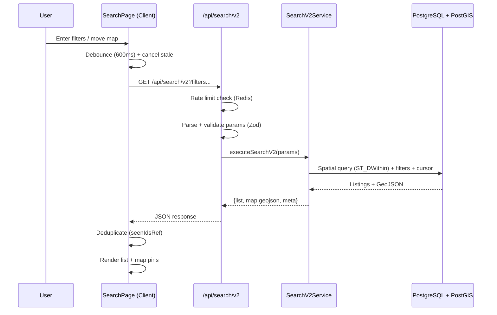
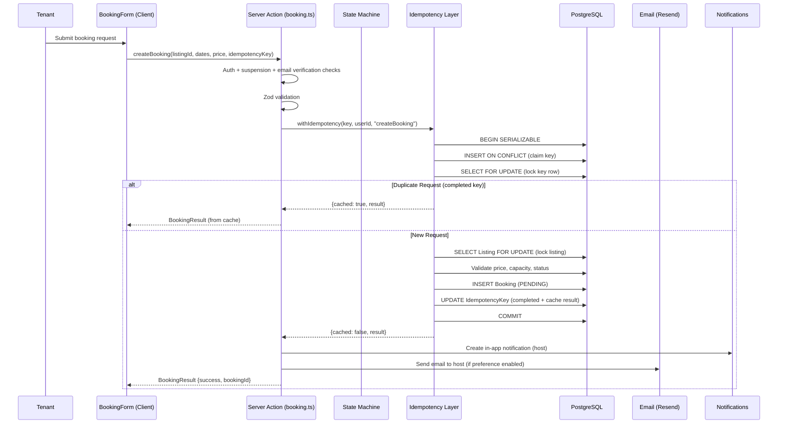
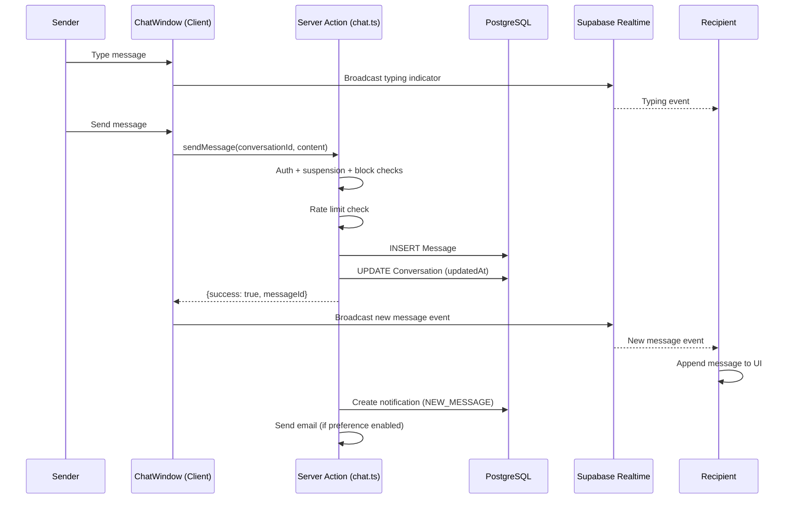

# Architecture

> System architecture reference for the Roomshare application.

## Table of Contents

- [System Overview](#system-overview)
- [Tech Stack](#tech-stack)
- [Architecture Diagram](#architecture-diagram)
- [Layer Boundaries](#layer-boundaries)
- [Directory Structure](#directory-structure)
- [Key Design Patterns](#key-design-patterns)
- [External Service Integrations](#external-service-integrations)
- [Data Flow](#data-flow)

---

## System Overview

Roomshare is a full-stack web application for room-sharing and co-living. It connects hosts who have available rooms with tenants searching for housing. The platform handles listing discovery via geospatial search, booking management with state machine validation, real-time messaging, identity verification, and admin moderation.

The application is built as a **Next.js 16 monolith** using the App Router. It runs on Vercel in production with a PostgreSQL+PostGIS database for geospatial queries, Supabase Realtime for live messaging, and Upstash Redis for distributed rate limiting.

### Design Priorities (in order)

1. **Correctness and abuse-resistance** -- server-side validation, state machines, idempotency
2. **User experience** -- fast, accessible, mobile-first
3. **Cost efficiency** -- caching, debouncing, minimal external API calls
4. **Maintainability** -- small diffs, strong tests, clear layer boundaries

---

## Tech Stack

| Category | Technology | Version |
|---|---|---|
| Framework | Next.js (App Router) | ^16.1.6 |
| Language | TypeScript | ^5 |
| UI Library | React | 19.2.0 |
| Styling | Tailwind CSS | ^4 |
| UI Primitives | Radix UI (Dialog, Select, Checkbox, Slider, Popover, Dropdown, Alert Dialog) | Various |
| Animations | Framer Motion | ^12.23.25 |
| Icons | Lucide React | ^0.554.0 |
| Maps | MapLibre GL + react-map-gl | ^5.15.0 / ^8.1.0 |
| Database | PostgreSQL + PostGIS (via Prisma) | PostGIS 16-3.4 |
| ORM | Prisma Client | ^6.19.0 |
| Authentication | NextAuth.js v5 (beta) + Prisma Adapter | ^5.0.0-beta.30 |
| Validation | Zod | ^4.2.0 |
| Real-time | Supabase Realtime (broadcast + presence) | ^2.84.0 |
| Rate Limiting | Upstash Redis + DB fallback | ^2.0.7 / ^1.35.8 |
| Email | Resend API | (HTTP API) |
| CAPTCHA | Cloudflare Turnstile | ^1.4.2 |
| AI | Vercel AI SDK with Groq + OpenAI providers | ^5.0.108 |
| Monitoring | Sentry (client, server, edge) | ^10.30.0 |
| Image Storage | Supabase Storage | (via supabase-js) |
| Carousel | Embla Carousel React | ^8.6.0 |
| Theming | next-themes | ^0.4.6 |
| CSS Processing | LightningCSS | ^1.30.2 |
| Testing | Jest + Testing Library + Playwright | ^30.2.0 / ^1.57.0 |
| Property Testing | fast-check | ^4.4.0 |
| Deployment | Vercel | (vercel.json crons) |
| Local DB | Docker Compose (postgis/postgis:16-3.4) | compose v3.8 |

---

## Architecture Diagram

```mermaid
graph TB
    subgraph Client ["Client (Browser)"]
        RC[React 19 Components]
        ML[MapLibre GL]
        SW[Service Worker]
        SR[Supabase Realtime Client]
    end

    subgraph NextJS ["Next.js 16 App Router"]
        subgraph Pages ["Server Components / Pages"]
            SP[Server Pages<br/>SSR + Streaming]
            CC[Client Components<br/>Interactivity]
        end

        subgraph API ["API Routes"]
            AR[REST API Routes<br/>/api/*]
            SA[Server Actions<br/>/app/actions/*]
            CR[Cron Jobs<br/>search-alerts, cleanup,<br/>refresh-search-docs]
        end

        subgraph Middleware
            MW[Middleware<br/>Suspension Check<br/>Auth Guard]
        end

        subgraph Services ["Service Layer (src/lib)"]
            BSM[Booking State Machine]
            IK[Idempotency Keys]
            RL[Rate Limiter<br/>DB + Redis + In-Memory]
            CB[Circuit Breaker]
            GC[Geocoding Service]
            EM[Email Service]
            NT[Notifications]
            SE[Search Engine<br/>v2 + Orchestrator]
            LG[Structured Logger]
            AU[Audit Logger]
        end
    end

    subgraph External ["External Services"]
        PG[(PostgreSQL<br/>+ PostGIS)]
        SB[Supabase<br/>Storage + Realtime]
        UR[Upstash Redis]
        RE[Resend Email]
        SN[Sentry]
        NM[Nominatim<br/>Geocoding]
        RD[Radar API<br/>Nearby Places]
        SM[Stadia Maps<br/>Map Tiles]
        CF[Cloudflare<br/>Turnstile]
        AI[Groq / OpenAI<br/>AI Chat]
    end

    RC --> SP
    RC --> AR
    RC --> SA
    ML --> SM
    SR --> SB

    MW --> AR
    MW --> SP

    SP --> Services
    AR --> Services
    SA --> Services
    CR --> Services

    Services --> PG
    RL --> UR
    RL --> PG
    CB --> UR
    CB --> NM
    CB --> RE
    CB --> PG
    EM --> RE
    GC --> NM
    NT --> PG
    SE --> PG
    AU --> PG
    LG --> SN
    IK --> PG

    style Client fill:#e1f5fe
    style NextJS fill:#fff3e0
    style External fill:#f3e5f5
```



---

## Layer Boundaries

The codebase enforces strict separation between three layers. Violations of these boundaries are considered architectural bugs.

### UI Layer (`src/components/`, `src/hooks/`, `src/contexts/`)

**Responsibilities:**
- Rendering, user interactions, client-side state
- Debouncing and cancelling stale requests (AbortController)
- Form validation (client-side, for UX; server re-validates)
- Map rendering, bottom sheet gestures, keyboard shortcuts

**Rules:**
- Must NOT import from `@/lib/prisma` or any server-only module
- Must NOT contain business logic (pricing, authorization, state transitions)
- Client components use `'use client'` directive

**Key contexts:**
| Context | Purpose |
|---|---|
| `FilterStateContext` | Search filter state management |
| `MapBoundsContext` | Map viewport bounds sharing |
| `ListingFocusContext` | Listing hover/focus synchronization between map and list |
| `SearchV2DataContext` | Search results data provider |
| `MobileSearchContext` | Mobile search overlay state |
| `SearchMapUIContext` | Search page UI mode coordination |
| `SearchTransitionContext` | Search loading/transition states |

**Key hooks:**
| Hook | Purpose |
|---|---|
| `useBatchedFilters` | Batches filter changes before URL update |
| `useDebouncedFilterCount` | Debounced filter impact count |
| `useFacets` | Search facet data fetching |
| `useAbortableServerAction` | Server action calls with AbortController |
| `useNetworkStatus` | Online/offline detection |
| `useBlockStatus` | User block relationship check |
| `useRateLimitHandler` | Rate limit response handling |

### Server Layer (`src/app/api/`, `src/app/actions/`, `src/lib/`)

**Responsibilities:**
- Input validation and sanitization (Zod schemas)
- Authentication and authorization checks
- Business rule enforcement (state machines, capacity checks)
- Rate limiting, idempotency, circuit breaking
- Orchestrating database operations within transactions
- Sending notifications and emails

**Rules:**
- All state transitions validated server-side (never trust client)
- Must use structured logging (no raw PII in logs)
- Must enforce suspension and email verification checks

**Server Actions** (`src/app/actions/`):
| Action Module | Purpose |
|---|---|
| `booking.ts` | Create booking with idempotency + serializable transactions |
| `manage-booking.ts` | Accept/reject/cancel with state machine validation |
| `create-listing.ts` | Listing creation with geocoding |
| `listing-status.ts` | ACTIVE/PAUSED/RENTED transitions |
| `get-listings.ts` | Listing data fetching |
| `chat.ts` | Message sending with block checks |
| `admin.ts` | Admin moderation actions with audit logging |
| `settings.ts` | User preference updates |
| `verification.ts` | Identity verification requests |
| `block.ts` | User blocking |
| `suspension.ts` | Account suspension checks |
| `profile.ts` | Profile updates |
| `notifications.ts` | Notification management |
| `saved-listings.ts` | Saved listing management |
| `saved-search.ts` | Saved search CRUD |
| `review-response.ts` | Host review responses |
| `filter-suggestions.ts` | Filter suggestion generation |

### Data Layer (`prisma/`, PostGIS)

**Responsibilities:**
- Schema definition and migrations
- Database constraints that prevent impossible states
- Indexes for query performance
- PostGIS spatial indexes for geospatial queries

**Rules:**
- Migrations must be safe for existing data (rollback notes required)
- Unique constraints enforce business invariants (e.g., one review per user per listing)
- Optimistic locking via `version` field on Booking model

**Key constraints:**
- `@@unique([tenantId, listingId, startDate, endDate])` on Booking -- prevents duplicate requests
- `@@unique([userId, listingId])` on SavedListing -- one save per user per listing
- `@@unique([authorId, listingId])` on Review -- one review per user per listing
- `@@unique([blockerId, blockedId])` on BlockedUser -- no duplicate blocks
- `@@unique([userId, endpoint, key])` on IdempotencyKey -- scoped idempotency

---

## Directory Structure

```
roomshare/
├── prisma/
│   └── schema.prisma              # Data models, enums, indexes, constraints
├── public/
│   └── sw.js                      # Service worker for offline support
├── src/
│   ├── app/
│   │   ├── layout.tsx             # Root layout with providers
│   │   ├── page.tsx               # Landing page
│   │   ├── search/page.tsx        # Search with map + list + filters
│   │   ├── listings/
│   │   │   ├── [id]/page.tsx      # Listing detail
│   │   │   ├── [id]/edit/page.tsx  # Edit listing
│   │   │   └── create/page.tsx    # Create listing
│   │   ├── bookings/page.tsx      # Booking management (sent + received)
│   │   ├── messages/
│   │   │   ├── page.tsx           # Conversation list
│   │   │   └── [id]/page.tsx      # Chat window
│   │   ├── profile/               # User profile (view + edit)
│   │   ├── admin/                 # Admin dashboard
│   │   │   ├── page.tsx           # Admin overview
│   │   │   ├── users/page.tsx     # User management
│   │   │   ├── listings/page.tsx  # Listing moderation
│   │   │   ├── reports/page.tsx   # Report review
│   │   │   ├── verifications/     # Identity verification review
│   │   │   └── audit/page.tsx     # Audit log viewer
│   │   ├── notifications/page.tsx # Notification center
│   │   ├── saved/page.tsx         # Saved listings
│   │   ├── saved-searches/        # Saved search alerts
│   │   ├── settings/page.tsx      # User settings + preferences
│   │   ├── login/page.tsx         # Login form
│   │   ├── signup/page.tsx        # Registration form
│   │   ├── forgot-password/       # Password reset request
│   │   ├── reset-password/        # Password reset form
│   │   ├── verify/page.tsx        # Email verification landing
│   │   ├── about/page.tsx         # About page
│   │   ├── privacy/page.tsx       # Privacy policy
│   │   ├── terms/page.tsx         # Terms of service
│   │   ├── offline/page.tsx       # Offline fallback
│   │   ├── actions/               # Server Actions (see Server Layer)
│   │   └── api/                   # API Routes
│   │       ├── auth/              # NextAuth + verification + password reset
│   │       ├── listings/          # Listing CRUD + status check
│   │       ├── search/            # Search v2 + facets
│   │       ├── messages/          # Messaging + unread count
│   │       ├── reviews/           # Review CRUD
│   │       ├── reports/           # Report submission
│   │       ├── favorites/         # Toggle favorite
│   │       ├── nearby/            # Radar nearby places
│   │       ├── chat/              # AI neighborhood chat
│   │       ├── agent/             # AI agent endpoint
│   │       ├── upload/            # Image upload (Supabase Storage)
│   │       ├── register/          # User registration
│   │       ├── verify/            # Identity verification
│   │       ├── map-listings/      # Map pin data
│   │       ├── search-count/      # Filter impact count
│   │       ├── metrics/           # Application metrics + ops
│   │       ├── health/            # Health checks (live + ready)
│   │       └── cron/              # Scheduled jobs
│   │           ├── search-alerts/ # Daily saved search alerts
│   │           ├── cleanup-rate-limits/ # Nightly rate limit cleanup
│   │           └── refresh-search-docs/ # 5-min search doc refresh
│   ├── components/
│   │   ├── ui/                    # Base UI primitives (button, input, dialog, etc.)
│   │   ├── auth/                  # Auth-related components
│   │   ├── chat/                  # Chat-specific components
│   │   ├── error/                 # Error boundary
│   │   ├── filters/               # Filter chips and applied filter display
│   │   ├── listings/              # Listing card, carousel, skeleton
│   │   ├── map/                   # Map client, markers, popups, boundary layers
│   │   ├── nearby/                # Nearby places map and panel
│   │   ├── neighborhood/          # Neighborhood intelligence module
│   │   ├── search/                # Search-specific (bottom sheet, pills, categories)
│   │   ├── skeletons/             # Loading skeleton components
│   │   ├── verification/          # Verification badge and button
│   │   ├── Navbar.tsx             # Main navigation
│   │   ├── Footer.tsx             # Footer
│   │   ├── Providers.tsx          # Client-side provider composition
│   │   └── ...                    # Feature-specific components
│   ├── contexts/                  # React contexts (see UI Layer)
│   ├── hooks/                     # Custom hooks (see UI Layer)
│   └── lib/                       # Shared business logic
│       ├── prisma.ts              # Prisma client singleton
│       ├── booking-state-machine.ts # Booking lifecycle state machine
│       ├── booking-utils.ts       # Booking query helpers
│       ├── idempotency.ts         # Idempotency key management
│       ├── rate-limit.ts          # DB-backed rate limiting
│       ├── rate-limit-redis.ts    # Redis-backed rate limiting (Upstash)
│       ├── with-rate-limit.ts     # Rate limit middleware wrapper (DB)
│       ├── with-rate-limit-redis.ts # Rate limit middleware wrapper (Redis)
│       ├── circuit-breaker.ts     # Circuit breaker pattern
│       ├── email.ts               # Email sending (Resend) with retry
│       ├── email-templates.ts     # HTML email templates
│       ├── notifications.ts       # In-app notification creation
│       ├── audit.ts               # Admin audit trail
│       ├── logger.ts              # Structured JSON logger with PII redaction
│       ├── geocoding.ts           # Geocoding orchestration
│       ├── geocoding-cache.ts     # Geocoding result caching
│       ├── supabase.ts            # Supabase client (Realtime + Storage)
│       ├── turnstile.ts           # Cloudflare CAPTCHA verification
│       ├── auth-helpers.ts        # Auth route classification, suspension check
│       ├── token-security.ts      # Token hashing for verification/reset
│       ├── filter-schema.ts       # Search filter Zod schemas
│       ├── search-params.ts       # URL search parameter parsing
│       ├── search-utils.ts        # Search query building
│       ├── schemas.ts             # Shared Zod validation schemas
│       ├── validation.ts          # Input validation utilities
│       ├── constants.ts           # Application constants
│       ├── env.ts                 # Environment variable access + feature flags
│       ├── request-context.ts     # Request-scoped context (request ID, tracing)
│       ├── timeout-wrapper.ts     # Timeout utility for async operations
│       ├── fetch-with-timeout.ts  # Fetch wrapper with AbortController timeout
│       ├── shutdown.ts            # Graceful shutdown handlers
│       └── search/                # Search subsystem
│           ├── search-v2-service.ts    # Unified search service
│           ├── search-orchestrator.ts  # Search query orchestration
│           ├── search-doc-sync.ts      # Search document synchronization
│           ├── search-doc-dirty.ts     # Dirty tracking for search docs
│           ├── search-doc-queries.ts   # Search document SQL queries
│           ├── cursor.ts               # Keyset cursor pagination
│           ├── transform.ts            # Result transformation
│           ├── types.ts                # Search type definitions
│           ├── natural-language-parser.ts # NLP search parsing
│           ├── split-stay.ts           # Split-stay search logic
│           └── hash.ts                 # Search parameter hashing
├── docker-compose.yml             # Local PostgreSQL+PostGIS
├── vercel.json                    # Vercel cron job schedules
├── next.config.ts                 # Next.js config (CSP, images, security headers)
├── instrumentation.ts             # Sentry init + graceful shutdown registration
├── sentry.client.config.ts        # Client-side Sentry
├── sentry.server.config.ts        # Server-side Sentry
├── sentry.edge.config.ts          # Edge runtime Sentry
└── auth.ts                        # NextAuth configuration and session management
```

---

## Key Design Patterns

### Circuit Breaker

Implemented in `src/lib/circuit-breaker.ts`. Prevents cascading failures when external services are unhealthy.

**States:** CLOSED (normal) --> OPEN (failing fast) --> HALF_OPEN (testing recovery)

**Pre-configured breakers:**

| Service | Failure Threshold | Reset Timeout | Success Threshold |
|---|---|---|---|
| Redis | 3 | 10s | 2 |
| Radar (nearby places) | 5 | 30s | 2 |
| Email (Resend) | 5 | 60s | 3 |
| Nominatim (geocoding) | 5 | 30s | 2 |
| PostGIS | 3 | 15s | 2 |

### Idempotency Keys

Implemented in `src/lib/idempotency.ts`. Prevents duplicate submissions for critical operations (booking creation).

- Entire flow runs inside one SERIALIZABLE transaction
- Key uniqueness scoped to `(userId, endpoint, key)`
- Atomic claim via `INSERT ON CONFLICT DO NOTHING` + `SELECT FOR UPDATE`
- Request body hashed (SHA-256 with deterministic key sorting) to detect payload mismatches
- Cached results returned for duplicate requests with `X-Idempotency-Replayed: true` header
- Automatic retry with exponential backoff for serialization conflicts (max 3 attempts)

### Rate Limiting (Tiered)

Three tiers of rate limiting, each with different tradeoffs:

1. **Redis-backed** (`src/lib/rate-limit-redis.ts`) -- Upstash sliding window, used for high-frequency endpoints (chat, metrics). Falls back to in-memory Map when Redis is unavailable.
2. **Database-backed** (`src/lib/rate-limit.ts`) -- PostgreSQL-based sliding window, used for most endpoints. Falls back to in-memory cache during DB errors with reduced limits.
3. **In-memory fallback** -- Emergency protection during transient outages. Non-persistent, best-effort.

All tiers fail closed (deny by default on errors) with degraded-mode fallback for availability.

### Cursor-Based Pagination

Implemented in `src/lib/search/cursor.ts`. Uses keyset pagination for deterministic, gap-free result sets. Search results client deduplicates via `seenIdsRef` (Set of listing IDs) with a 60-item client-side cap.

### Optimistic Locking

The `Booking` model has a `version` field (default 1). Status updates use `updateMany` with a `version` filter and increment on success. If `updateResult.count === 0`, a concurrent modification occurred and the request is rejected with error code `CONCURRENT_MODIFICATION`.

### Request Context

Implemented in `src/lib/request-context.ts`. Provides request-scoped context (request ID, tracing information) propagated through the call stack. Used by the structured logger for correlation.

### Abort Controllers and Debouncing

Client-side patterns for search and map interactions:
- 600ms debounce on map move events for area count requests
- `AbortController` cancels stale in-flight requests
- Client cache (30s) prevents redundant API calls
- Maximum 1 in-flight request at a time for search count

---

## External Service Integrations

| Service | Purpose | Adapter Location | Circuit Breaker |
|---|---|---|---|
| **PostgreSQL + PostGIS** | Primary database with geospatial queries | `src/lib/prisma.ts` | `postgis` |
| **Supabase Realtime** | Live messaging (broadcast), typing indicators (presence), image storage | `src/lib/supabase.ts` | No |
| **Upstash Redis** | Distributed rate limiting across serverless instances | `src/lib/rate-limit-redis.ts` | `redis` |
| **Resend** | Transactional email (booking notifications, verification, password reset) | `src/lib/email.ts` | `email` |
| **Sentry** | Error tracking, performance monitoring, session replay | `sentry.*.config.ts` | No |
| **Photon (Komoot)** | Address autocomplete (search-as-you-type) | `src/lib/geocoding/photon.ts` | No |
| **Nominatim (OSM)** | Forward geocoding (address to coordinates) | `src/lib/geocoding.ts` + `src/lib/geocoding/nominatim.ts` | `nominatimGeocode` |
| **Radar** | Nearby places search (points of interest) | `src/app/api/nearby/route.ts` | `radar` |
| **Stadia Maps** | Map tile serving for MapLibre GL | Client-side (CSP connect-src) | No |
| **Cloudflare Turnstile** | Bot protection on registration and sensitive forms | `src/lib/turnstile.ts` | No |
| **Groq / OpenAI** | AI-powered neighborhood chat assistant | `src/app/api/chat/route.ts` | No |
| **Google** | OAuth sign-in provider | NextAuth config | No |

---

## Data Flow

### Search Flow



### Booking Flow



### Messaging Flow



---

## Cron Jobs

Configured in `vercel.json`, these run as Vercel Cron:

| Schedule | Endpoint | Purpose |
|---|---|---|
| `0 9 * * *` (daily 9am UTC) | `/api/cron/search-alerts` | Send email alerts for saved searches with new matches |
| `0 3 * * *` (daily 3am UTC) | `/api/cron/cleanup-rate-limits` | Purge expired `RateLimitEntry` rows from the database |
| `*/5 * * * *` (every 5 min) | `/api/cron/refresh-search-docs` | Refresh dirty search documents for search index consistency |

---

## Security Headers

Configured in `next.config.ts`, applied to all routes:

- **Content-Security-Policy** -- Strict CSP with explicit allowlists for scripts, styles, images, connections, frames
- **X-Frame-Options: DENY** -- Prevents clickjacking
- **Strict-Transport-Security** -- HSTS with preload
- **X-Content-Type-Options: nosniff** -- Prevents MIME sniffing
- **Referrer-Policy: origin-when-cross-origin** -- Limits referrer leakage
- **Permissions-Policy** -- Disables camera, microphone; restricts geolocation to self
- **X-XSS-Protection: 1; mode=block** -- Legacy XSS protection
- **Service Worker** served with `no-cache, no-store, must-revalidate`
- **X-Powered-By** header disabled

---

## Observability

### Sentry Integration

Three separate Sentry configurations for comprehensive coverage:

- **Client** (`sentry.client.config.ts`) -- Browser errors, performance traces (10% in production), session replay (10% normal, 100% on error). Masks all text, blocks all media in replays. Filters out AbortError/fetch noise.
- **Server** (`sentry.server.config.ts`) -- Node.js runtime errors and traces
- **Edge** (`sentry.edge.config.ts`) -- Edge runtime errors (middleware)

PII protection: `sendDefaultPii: false` enforced on all configs.

### Structured Logging

`src/lib/logger.ts` outputs JSON logs with automatic PII field redaction. Every log entry includes timestamp, level, message, requestId (for correlation), service name, and environment. Sensitive fields (password, token, email, etc.) are automatically redacted.

### Health Checks

- `/api/health/live` -- Liveness probe (server is running)
- `/api/health/ready` -- Readiness probe (database connectivity)

### Instrumentation

`instrumentation.ts` runs at Next.js startup to initialize Sentry and register graceful shutdown handlers (Prisma disconnect, Sentry flush) for clean process termination.
