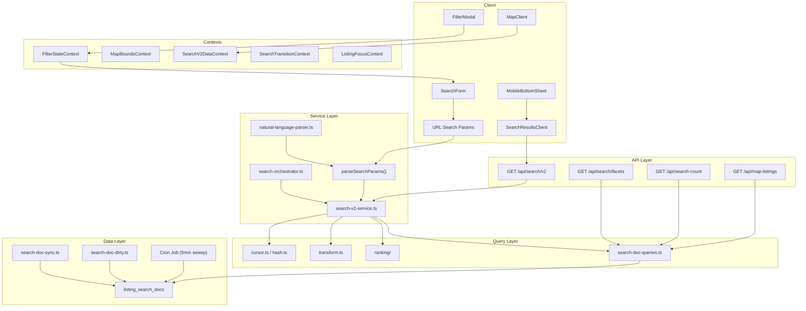

# Search System

Comprehensive documentation for Roomshare's search subsystem covering the full stack from URL parameters to rendered results.

## Table of Contents

- [Architecture Overview](#architecture-overview)
- [Search V2 Service](#search-v2-service)
- [Search Orchestrator](#search-orchestrator)
- [Ranking and Scoring](#ranking-and-scoring)
- [Filter System](#filter-system)
- [Faceted Search](#faceted-search)
- [Cursor-Based Pagination](#cursor-based-pagination)
- [Natural Language Parser](#natural-language-parser)
- [Split-Stay Matching](#split-stay-matching)
- [Near Matches](#near-matches)
- [Map Integration](#map-integration)
- [Mobile UX](#mobile-ux)
- [Performance](#performance)
- [Search Doc Sync](#search-doc-sync)
- [API Reference](#api-reference)

---

## Architecture Overview

The search system is a multi-layered pipeline that transforms URL parameters into paginated listing results with map data. It uses a denormalized `listing_search_docs` table for fast single-table reads, avoiding expensive multi-table JOINs at query time.



### Key Design Decisions

1. **Denormalized search table**: `listing_search_docs` stores pre-joined, pre-computed data (lat/lng, avg_rating, recommended_score) for single-table reads.
2. **Unified V2 endpoint**: A single `/api/search/v2` returns both list results and map data in one response, reducing waterfall requests.
3. **Feature flags**: SearchDoc (`ENABLE_SEARCH_DOC`), keyset pagination (`ENABLE_SEARCH_KEYSET`), ranking (`ENABLE_SEARCH_RANKING`), and V2 (`ENABLE_SEARCH_V2`) can be toggled independently.
4. **Hybrid pagination**: Uses `LIMIT+1` pattern for `hasNextPage` detection without full `COUNT(*)`. Exact count only provided when total is 100 or fewer.

---

## Search V2 Service

**File**: `src/lib/search/search-v2-service.ts`

The core search function that powers both SSR page loads and the API route. Called directly by `page.tsx` for SSR (avoiding HTTP self-call overhead) or via the `/api/search/v2` route handler.

### Request Flow

```
1. Parse raw URL params via parseSearchParams()
2. Clamp bounds if they exceed MAX_LAT_SPAN / MAX_LNG_SPAN
3. Block unbounded searches (text query without geographic bounds)
4. Detect feature flags: SearchDoc, keyset pagination, ranking
5. Execute list + map queries IN PARALLEL (Promise.allSettled)
6. Apply ranking scores for pin tiering (if enabled)
7. Transform results to V2 response shape
8. Return { response, paginatedResult }
```

### Key Interface

```typescript
interface SearchV2Params {
  rawParams: Record<string, string | string[] | undefined>;
  limit?: number;  // defaults to 12
}

interface SearchV2Result {
  response: SearchV2Response | null;
  paginatedResult: PaginatedResultHybrid<ListingData> | null;
  error?: string;
  unboundedSearch?: boolean;  // signals UI to prompt for location
}
```

### Parallel Query Execution

List and map queries run concurrently via `Promise.allSettled` with independent timeouts. If the map query fails, list results still return with a `MAP_QUERY_FAILED` warning. If the list query fails, the entire request returns an error.

---

## Search Orchestrator

**File**: `src/lib/search/search-orchestrator.ts`

Provides v2-to-v1 fallback logic for the search page. Extracted from `page.tsx` for testability.

### Fallback Flow

```
1. If useV2=true  -> try executeSearchV2()
2. If v2 fails    -> fall back to v1 (getListingsPaginated)
3. If useV2=false -> use v1 directly
4. If v1 fails    -> return empty result with error
```

### Result Shape

```typescript
interface SearchOrchestrationResult {
  paginatedResult: PaginatedResultHybrid<ListingData>;
  v2MapData: V2MapData | null;
  fetchError: string | null;
  usedV1Fallback: boolean;
}
```

---

## Ranking and Scoring

**Files**: `src/lib/search/ranking/score.ts`, `rank.ts`, `types.ts`, `index.ts`

A heuristic-based ranking system (v1) that scores listings for map pin tiering. Designed for future ML integration.

### Signal Weights

All signals are normalized to 0-1. Default weights sum to 1.0:

| Signal | Weight | Description | Normalization |
|--------|--------|-------------|---------------|
| `quality` | 0.25 | Pre-computed `recommended_score` | Sigmoid (k=0.04, midpoint=50) |
| `rating` | 0.25 | Rating with review confidence | Bayesian average (prior=3.5, min reviews=5) |
| `price` | 0.15 | Price competitiveness vs local median | Gaussian decay from median (sigma=0.5) |
| `recency` | 0.15 | Listing freshness | Exponential decay (30-day half-life) |
| `geo` | 0.20 | Distance from map center | Exponential decay (5km half-distance) |

### Scoring Algorithm

```
score = quality*0.25 + rating*0.25 + price*0.15 + recency*0.15 + geo*0.20
```

**Quality signal**: `recommended_score = avg_rating*20 + log(1+viewCount)*10*decayFactor + reviewCount*5 + freshnessBoost`

**Price competitiveness**: Uses log-ratio Gaussian decay. Score is 1.0 at median price, decaying toward extremes.

**Rating (Bayesian)**: `adjustedRating = (3.5*5 + rating*count) / (5 + count)` -- new listings with few reviews regress toward 3.5/5.

### Pin Tiering

When ranking is enabled and results are sparse (<50 listings), pins are divided into "primary" and "mini" tiers:
- Primary pins (larger, more visible) go to the top-scored listings
- Mini pins (smaller) fill out the remaining markers
- `NEXT_PUBLIC_PRIMARY_PINS` env var controls the primary limit (default: 40, range: 10-120)

### Debug Mode

Append `?debugRank=1` (non-production only, gated by `searchDebugRanking` feature flag) to see top-5 signal breakdowns in `meta.topSignals`.

---

## Filter System

**Files**: `src/lib/filter-schema.ts`, `src/lib/search-params.ts`

All filters are validated through a canonical Zod schema with case-insensitive matching, allowlist enforcement, and alias support.

### Filter Types

| Filter | Type | Validation | DB Operation |
|--------|------|------------|--------------|
| `query` | text | Max 200 chars, sanitized | Full-text search (tsvector/plainto_tsquery) |
| `minPrice` / `maxPrice` | number | 0 to 1,000,000,000, clamped | `d.price >= $N` / `d.price <= $N` |
| `amenities` | string[] | Allowlist, case-insensitive | `d.amenities_lower @> $N::text[]` (AND logic, GIN) |
| `houseRules` | string[] | Allowlist, case-insensitive | `d.house_rules_lower @> $N::text[]` (AND logic, GIN) |
| `languages` | string[] | Normalized via language map | `d.household_languages_lower && $N::text[]` (OR logic, GIN) |
| `roomType` | enum | Private Room, Shared Room, Entire Place | `LOWER(d.room_type) = LOWER($N)` |
| `leaseDuration` | enum | Month-to-month, 3/6/12 months, Flexible | `LOWER(d.lease_duration) = LOWER($N)` |
| `genderPreference` | enum | MALE_ONLY, FEMALE_ONLY, NO_PREFERENCE | `d.gender_preference = $N` |
| `householdGender` | enum | ALL_MALE, ALL_FEMALE, MIXED | `d.household_gender = $N` |
| `moveInDate` | date | YYYY-MM-DD, today to +2 years | `d.move_in_date IS NULL OR d.move_in_date <= $N` |
| `bounds` | object | lat: -90..90, lng: -180..180 | PostGIS `ST_MakeEnvelope` + geography `&&` |
| `sort` | enum | recommended, newest, price_asc, price_desc, rating | ORDER BY clause |

### Alias Support

URL-friendly aliases map to canonical values:

```
private     -> Private Room
6_months    -> 6 months
mtm         -> Month-to-month
```

### Validation Rules

- `minPrice > maxPrice` throws a validation error (not silently swapped)
- `minLat > maxLat` throws a validation error
- Longitude is NOT swapped to support antimeridian crossing
- Array filters capped at `MAX_ARRAY_ITEMS` to prevent abuse
- Price clamped to `MAX_SAFE_PRICE` (1,000,000,000)
- Page clamped to `MAX_SAFE_PAGE`

---

## Faceted Search

**File**: `src/app/api/search/facets/route.ts`

Returns per-filter-value counts based on current filter state, enabling the UI to show how many listings match each option.

### Facet Response

```typescript
interface FacetsResponse {
  amenities: Record<string, number>;    // { "Wifi": 45, "Parking": 23 }
  houseRules: Record<string, number>;   // { "Pets allowed": 30 }
  roomTypes: Record<string, number>;    // { "Private Room": 50 }
  priceRanges: {
    min: number | null;
    max: number | null;
    median: number | null;
  };
  priceHistogram: {
    bucketWidth: number;
    buckets: { min: number; max: number; count: number }[];
  } | null;
}
```

### Sticky Faceting

Each facet query EXCLUDES the filter being aggregated. For example, the amenities facet excludes the amenities filter so users can see all available options. This is standard "sticky" or "disjunctive" faceting.

### Price Histogram

Adaptive bucket widths based on price range:
- Range <= $1,000: $50 buckets
- Range <= $5,000: $250 buckets
- Range <= $10,000: $500 buckets
- Range > $10,000: $1,000 buckets

### Caching

- Server: `unstable_cache` with 30s TTL
- Client: `useFacets` hook maintains 30s in-memory cache, 300ms debounce, only fetches when filter drawer is open

---

## Cursor-Based Pagination

**Files**: `src/lib/search/cursor.ts`, `src/lib/search/hash.ts`

Two pagination strategies are supported, gated by feature flags:

### Offset-Based (Legacy)

Simple `{p: pageNumber}` encoded as base64url. Used when `ENABLE_SEARCH_KEYSET` is disabled.

### Keyset-Based

Stable cursor that prevents result drift (duplicates/missing items) during scrolling. The cursor encodes the ORDER BY column values of the last item.

```typescript
interface KeysetCursor {
  v: 1;                    // Version for future format changes
  s: SortOption;           // Sort to validate cursor matches query
  k: (string | null)[];   // Key values in ORDER BY sequence (strings for float precision)
  id: string;             // Tie-breaker listing ID (CUID)
}
```

### Key Counts Per Sort

| Sort | Keys | ORDER BY |
|------|------|----------|
| `recommended` | 2 | `recommended_score DESC, listing_created_at DESC, id ASC` |
| `newest` | 1 | `listing_created_at DESC, id ASC` |
| `price_asc` | 2 | `price ASC NULLS LAST, listing_created_at DESC, id ASC` |
| `price_desc` | 2 | `price DESC NULLS LAST, listing_created_at DESC, id ASC` |
| `rating` | 3 | `avg_rating DESC NULLS LAST, review_count DESC, listing_created_at DESC, id ASC` |

### Keyset WHERE Clause

Uses explicit OR-chains (NOT PostgreSQL tuple comparison) to correctly handle mixed ASC/DESC columns and NULLs. For example, `price_asc` with a non-null cursor price:

```sql
(d.price > $cursor_price)
OR (d.price IS NULL)
OR (d.price = $cursor_price AND d.listing_created_at < $cursor_date)
OR (d.price = $cursor_price AND d.listing_created_at = $cursor_date AND d.id > $cursor_id)
```

### Backward Compatibility

`decodeCursorAny()` auto-detects whether a cursor is keyset or legacy format, enabling rolling deployment without breaking existing pagination tokens.

### Client-Side Invariants

- **Cursor reset**: `SearchResultsClient` is keyed by `searchParamsString` -- any filter/sort/query change remounts the component, resetting cursor and accumulated listings.
- **Deduplication**: `seenIdsRef` (Set of listing IDs) deduplicates across all "Load more" appends.
- **60-item cap**: Client stops loading more at `MAX_ACCUMULATED=60` to protect low-end devices.
- **URL shareability**: URLs contain only initial search params (no cursor). "Load more" state is ephemeral.

---

## Natural Language Parser

**File**: `src/lib/search/natural-language-parser.ts`

Extracts structured filters from free-text queries using pattern matching (no LLM). Runs client-side before the search request.

### Examples

```
"furnished room under $1000 in Austin"
  -> { location: "Austin", maxPrice: "1000", amenities: ["Furnished"] }

"pet friendly entire place $800-$1200"
  -> { minPrice: "800", maxPrice: "1200", houseRules: ["Pets allowed"], roomType: "Entire Place" }

"month to month with parking near downtown"
  -> { location: "downtown", leaseDuration: "Month-to-month", amenities: ["Parking"] }
```

### Extraction Priority

1. **Price patterns**: `under $X`, `over $X`, `$X-$Y`, `between $X and $Y`
2. **Room type**: `private room`, `shared room`, `entire place`, `studio`
3. **Amenities**: wifi, ac, parking, washer, dryer, kitchen, gym, pool, furnished
4. **House rules**: pet friendly, smoking ok, couples allowed, guests allowed
5. **Lease duration**: month-to-month, short-term, flexible, 3/6/12 months
6. **Location**: Remaining text after stripping recognized patterns

Returns `null` if no structured data was extracted (treated as plain location search).

---

## Split-Stay Matching

**File**: `src/lib/search/split-stay.ts`

For long stays (6+ months), suggests pairs of listings that together cover the full duration at a lower combined cost.

### How It Works

1. Only activates for searches with `stayMonths >= 6` and at least 2 listings
2. Sorts listings by price ascending
3. Pairs budget-friendly with premium options (first with last)
4. Returns up to 2 pairs with combined price and split label (e.g., "3 mo + 3 mo")

### Current Limitations

V1 implementation does not check actual date availability. It pairs by price only. Future versions will require date-aware availability data in the schema.

---

## Near Matches

**File**: `src/lib/near-matches.ts`

When search results are low (<5 exact matches on page 1), the system automatically expands filters to find "near match" listings that almost meet criteria.

### Expansion Rules

Only ONE dimension is expanded at a time to keep results relevant:

| Priority | Dimension | Expansion | Example |
|----------|-----------|-----------|---------|
| 1 | Price | +/-10% of min/max price | $1000 max becomes $1100 max |
| 2 | Move-in date | -7 days from requested date | Jan 15 becomes Jan 8 |

### Result Merging

1. Run original query (exact matches)
2. If exact matches < 5, run expanded query
3. Filter expanded results to exclude exact match IDs
4. Tag remaining as `isNearMatch: true`
5. Merge: exact matches first, then near matches (up to 5 near matches)

The UI renders a `NearMatchSeparator` component between exact and near matches.

### Filter Suggestions

`generateFilterSuggestions()` returns ranked suggestions for which filters to relax, shown in the zero-results UI:

1. Price range (highest impact)
2. Move-in date
3. Room type
4. Amenities count
5. Lease duration

---

## Map Integration

### Map Listings Endpoint

**File**: `src/app/api/map-listings/route.ts`

Fetches listings for map markers based on current viewport bounds and active filters.

- **Max markers**: 200 (`MAX_MAP_MARKERS`) -- returns truncation info when exceeded
- **Bounds required**: Map queries always require geographic bounds
- **Window function**: `COUNT(*) OVER()` provides total matching count before LIMIT
- **Privacy**: Listing coordinates use privacy circles (fuzzy location)
- **Bounds validation**: Oversized bounds are rejected or clamped (`MAX_LAT_SPAN`, `MAX_LNG_SPAN`)

### Response Modes

Determined by map listing count:

| Count | Mode | Map Data |
|-------|------|----------|
| >= 50 | `geojson` | GeoJSON FeatureCollection only (client-side clustering via Mapbox) |
| < 50 | `pins` | GeoJSON + tiered pin array (primary/mini markers) |

### GeoJSON Format

Always returned. Used by Mapbox `<Source cluster={true}>` for client-side clustering:

```json
{
  "type": "FeatureCollection",
  "features": [{
    "type": "Feature",
    "geometry": { "type": "Point", "coordinates": [-97.73, 30.27] },
    "properties": { "id": "...", "title": "...", "price": 800, "image": "...", "availableSlots": 2, "ownerId": "..." }
  }]
}
```

### Pin Tiering

For sparse results, pins are grouped by coordinate and tiered into primary (large) and mini (small) markers using the ranking score map.

### List-Map Focus Sync

The `ListingFocusContext` enables bidirectional hover/selection sync:
- Hovering a list card highlights the corresponding map marker
- Clicking a map marker scrolls to and highlights the list card
- `SearchMapUIContext` handles "View on map" button actions (flyTo + popup)

---

## Mobile UX

### Bottom Sheet

**File**: `src/components/search/MobileBottomSheet.tsx`

Map is always visible on mobile. List results appear in a draggable bottom sheet overlay.

**Snap Points** (fractions of viewport height):
- Collapsed: ~15vh (header peek)
- Half: ~50vh (default)
- Expanded: ~85vh (near full screen)

**Gesture Handling**:
- Drag handle/header to resize
- When expanded and scrolled to top, dragging down collapses
- Flick velocity (>0.4 px/ms) determines snap direction
- Rubber-band effect at sheet edges (max 80px overscroll)
- Escape key collapses to half position
- CSS scroll-snap on content for card-level snapping

### Mobile Card Layout

**File**: `src/components/search/MobileCardLayout.tsx`

Optimized card layout for mobile viewports with horizontal image carousel and compact metadata display.

### Pull to Refresh

**File**: `src/components/search/PullToRefresh.tsx`

Native-feeling pull-to-refresh gesture for the bottom sheet content.

### Category Tabs

**Files**: `src/components/search/CategoryBar.tsx`, `CategoryTabs.tsx`

Horizontal scrollable tabs for quick room type filtering (All, Private Room, Shared Room, Entire Place).

### Compact Search Pill

**File**: `src/components/search/CompactSearchPill.tsx`

Collapsed search bar showing current location/query. Tap to expand into full search form.

### Floating Map Button

**File**: `src/components/search/FloatingMapButton.tsx`

Fixed-position button to toggle between list and map views on mobile.

---

## Performance

### Debouncing

| Action | Debounce | Mechanism |
|--------|----------|-----------|
| Filter count fetch | 300ms | `useDebouncedFilterCount` |
| Facets fetch | 300ms | `useFacets` |
| Area count on map move | 600ms | `MapBoundsContext` |
| Map bounds update | Configured per interaction | `useDebounce` |

### AbortController

All search-related fetches use `AbortController` to cancel stale requests:
- Filter changes cancel previous count/facets fetches
- Map panning cancels previous area count requests
- Only the most recent request is honored

### Caching Strategy

| Layer | TTL | Scope |
|-------|-----|-------|
| Next.js `unstable_cache` (list) | 60s | Per normalized filter+page combination |
| Next.js `unstable_cache` (map) | 60s | Per normalized filter combination |
| Next.js `unstable_cache` (count) | 60s | Per normalized filter (no page/limit) |
| Next.js `unstable_cache` (facets) | 30s | Per normalized filter combination |
| CDN (`Cache-Control` header) | s-maxage=60, stale-while-revalidate=120 | V2 API response |
| Client count cache | 30s | In-memory Map in hook |
| Client facets cache | 30s | In-memory Map in hook |
| Area count client cache | 30s | Per bounds string |
| Query hash quantization | ~100m | Bounds quantized with BOUNDS_EPSILON (0.001) |

### Query Timeouts

- Search queries: 5s statement timeout (`SET LOCAL statement_timeout`)
- Overall request: `withTimeout()` wrapper with `DEFAULT_TIMEOUTS.DATABASE`
- Prevents runaway queries from holding connections

### Hybrid Pagination Count

Instead of expensive `COUNT(*)`, uses a subquery with `LIMIT 101`:
- If count <= 100: return exact count
- If count > 100: return `null` (UI shows "100+ results")

This avoids full-table scans on large result sets while still providing exact counts for small sets.

### Unbounded Query Protection

- Text searches without geographic bounds are blocked (prevents full-table scans)
- Browse-all queries (no text, no bounds) are capped at `MAX_UNBOUNDED_RESULTS=48`
- Unbounded page navigation capped to prevent `?page=1000` DOS attacks

---

## Search Doc Sync

### Background Sync

**File**: `src/lib/search/search-doc-sync.ts`

Immediately upserts a search document when a listing is created or updated, making it searchable within seconds instead of waiting for the next 5-minute cron sweep.

### Recommended Score Formula

```
recommendedScore = (avgRating * 20) + (log(1 + viewCount) * 10 * decayFactor) + (reviewCount * 5) + freshnessBoost
```

Where:
- `decayFactor = max(0.1, 1 - (daysSinceCreation/30) * 0.5)` -- 30-day half-life on views
- `freshnessBoost = 15 * (1 - daysSinceCreation/7)` for first 7 days, then 0

### Dirty Flag System

**File**: `src/lib/search/search-doc-dirty.ts`

Marks listings as dirty when they change, triggering SearchDoc refresh on the next cron run.

**Dirty reasons**: `listing_created`, `listing_updated`, `status_changed`, `view_count`, `review_changed`

Uses `INSERT ON CONFLICT DO UPDATE` for idempotency. Fire-and-forget -- failure to mark dirty does not fail the parent mutation.

### Data Consistency Model

```
Listing mutation -> Sync upsert (immediate) -> Dirty flag (backup)
                                             -> Cron sweep (every 5min, catches missed updates)
```

---

## API Reference

### GET /api/search/v2

Unified search endpoint returning list + map data.

**Query Parameters**: All filter params plus `cursor`, `v2`, `searchDoc`, `ranker`, `debugRank`

**Response** (`SearchV2Response`):

```typescript
{
  meta: {
    queryHash: string;        // 16-char SHA256 of normalized filters
    generatedAt: string;      // ISO timestamp
    mode: "geojson" | "pins";
    warnings?: string[];      // e.g., ["MAP_QUERY_FAILED"]
    rankingVersion?: string;  // Debug only
    topSignals?: DebugSignals[]; // Debug only (max 5)
  },
  list: {
    items: SearchV2ListItem[];
    nextCursor: string | null;
    total: number | null;     // Exact if <=100, null if >100
  },
  map: {
    geojson: GeoJSON.FeatureCollection;  // Always present
    pins?: SearchV2Pin[];     // Only when mode="pins"
    truncated?: boolean;      // True when > MAX_MAP_MARKERS
    totalCandidates?: number; // Only when truncated
  }
}
```

**Rate Limiting**: Redis-based, using "map" bucket type.

**Cache Headers**: `public, s-maxage=60, max-age=30, stale-while-revalidate=120`

### GET /api/search/facets

Returns per-filter-value counts for the filter drawer.

**Query Parameters**: Same filter params as search (bounds, query, amenities, etc.)

**Response**: See [Faceted Search](#faceted-search) section.

**Cache**: `private, no-store` (dynamic content). Server-side 30s `unstable_cache`.

### GET /api/search-count

Returns listing count for filter drawer "Show X listings" button.

**Response**: `{ count: number | null, boundsRequired?: boolean }`

Count is `null` when > 100 (shows "100+").

### GET /api/map-listings

Fetches map markers for the persistent map component.

**Query Parameters**: Bounds (required) + all filter params.

**Response**: Array of `MapListingData` with location coordinates.

---

## File Index

### Core Services
- `src/lib/search/search-v2-service.ts` -- Main search execution
- `src/lib/search/search-orchestrator.ts` -- V2/V1 fallback logic
- `src/lib/search/search-doc-queries.ts` -- SearchDoc SQL queries

### Ranking
- `src/lib/search/ranking/index.ts` -- Module entry, feature flag check
- `src/lib/search/ranking/score.ts` -- Signal normalization functions
- `src/lib/search/ranking/rank.ts` -- Score map building, sorting
- `src/lib/search/ranking/types.ts` -- Type definitions

### Pagination and Hashing
- `src/lib/search/cursor.ts` -- Keyset cursor encode/decode
- `src/lib/search/hash.ts` -- Query hash generation, legacy cursor

### Filters and Parsing
- `src/lib/filter-schema.ts` -- Zod filter schema, normalization
- `src/lib/search-params.ts` -- URL param parsing
- `src/lib/search/natural-language-parser.ts` -- NLP query extraction

### Transforms
- `src/lib/search/transform.ts` -- GeoJSON, pin, list item transforms
- `src/lib/search/types.ts` -- Shared V2 types and constants

### Near Matches and Split-Stay
- `src/lib/near-matches.ts` -- Filter expansion, near-match tagging
- `src/lib/search/split-stay.ts` -- Split-stay pair finding

### Data Sync
- `src/lib/search/search-doc-sync.ts` -- Immediate search doc upsert
- `src/lib/search/search-doc-dirty.ts` -- Dirty flag helpers

### API Routes
- `src/app/api/search/v2/route.ts` -- Unified search endpoint
- `src/app/api/search/facets/route.ts` -- Facet counts endpoint
- `src/app/api/search-count/route.ts` -- Count endpoint
- `src/app/api/map-listings/route.ts` -- Map markers endpoint

### Client Components
- `src/components/search/SearchResultsClient.tsx` -- Paginated list with "Load more"
- `src/components/search/FilterModal.tsx` -- Full filter drawer
- `src/components/search/MobileBottomSheet.tsx` -- Draggable mobile sheet
- `src/components/search/CategoryBar.tsx` -- Room type tabs
- `src/components/search/PriceRangeFilter.tsx` -- Price slider with histogram
- `src/components/search/PriceHistogram.tsx` -- Price distribution visualization

### Contexts
- `src/contexts/FilterStateContext.tsx` -- Pending filter state
- `src/contexts/MapBoundsContext.tsx` -- Map bounds and area count
- `src/contexts/SearchV2DataContext.tsx` -- V2 map data sharing
- `src/contexts/SearchTransitionContext.tsx` -- Navigation transitions
- `src/contexts/ListingFocusContext.tsx` -- List-map hover/selection sync
- `src/contexts/SearchMapUIContext.tsx` -- Card-to-map focus
- `src/contexts/MobileSearchContext.tsx` -- Mobile search bar state

### Hooks
- `src/hooks/useBatchedFilters.ts` -- Batched filter state management
- `src/hooks/useDebouncedFilterCount.ts` -- Debounced count fetcher
- `src/hooks/useFacets.ts` -- Facet data with caching
- `src/hooks/useFilterImpactCount.ts` -- Per-filter impact counts
