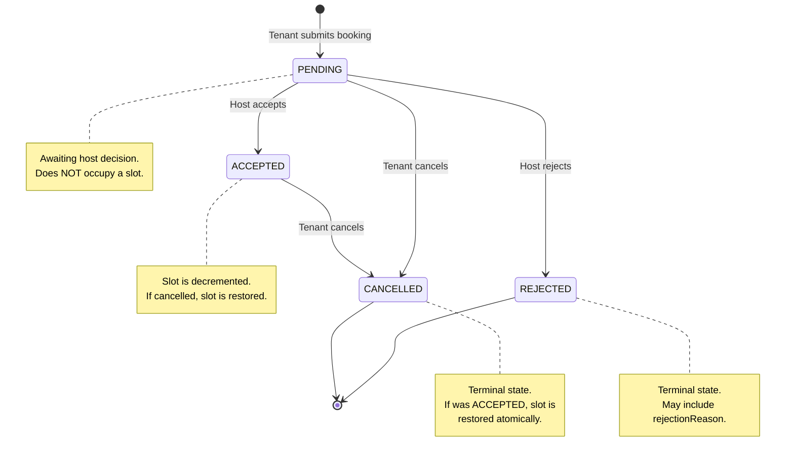
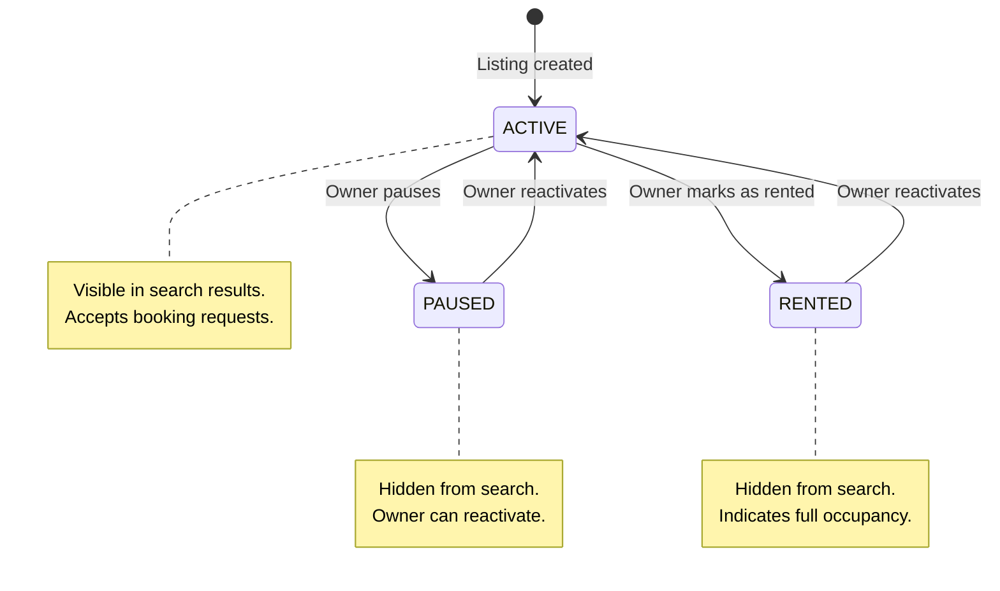
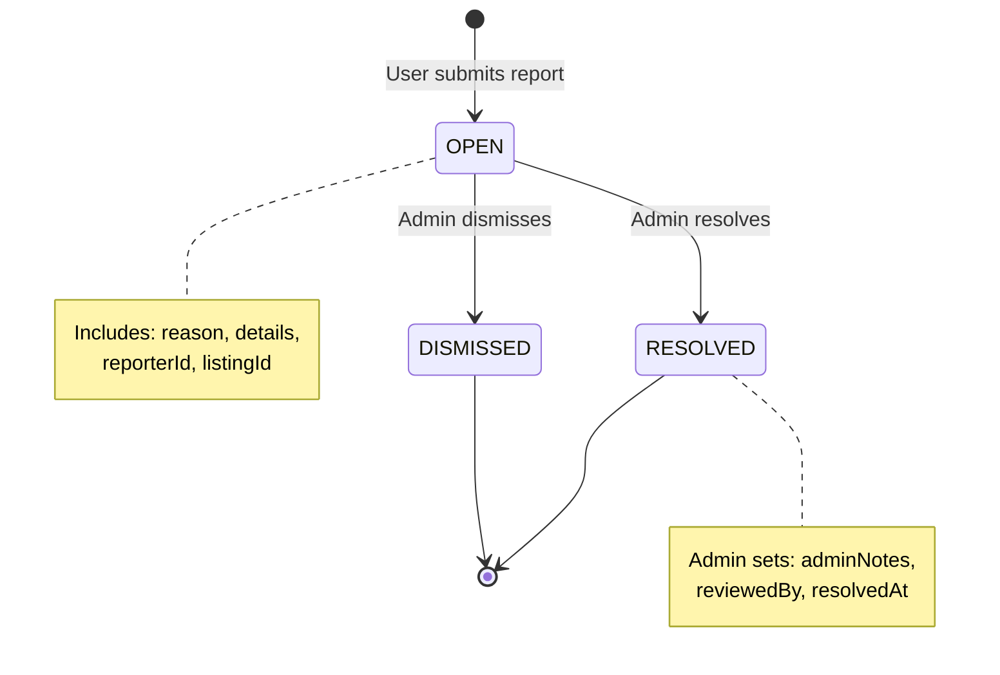
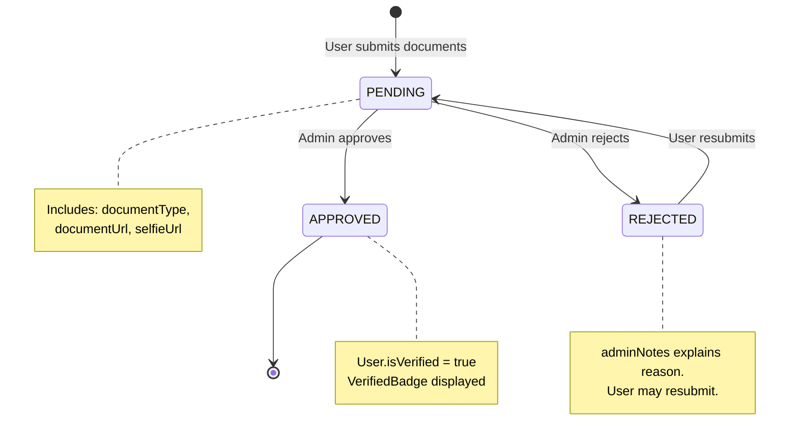

# State Machines

> State lifecycle documentation for all stateful entities in Roomshare.

## Table of Contents

- [Booking Lifecycle](#booking-lifecycle)
- [Listing States](#listing-states)
- [Report Workflow](#report-workflow)
- [Verification Flow](#verification-flow)
- [Notification Types](#notification-types)
- [Business Rules](#business-rules)

---

## Booking Lifecycle

The booking state machine is implemented in `src/lib/booking-state-machine.ts` and enforced in `src/app/actions/manage-booking.ts`. All transitions are validated server-side before any database update.

### States

| State | Description | Terminal |
|---|---|---|
| `PENDING` | Tenant has submitted a booking request. Awaiting host decision. | No |
| `ACCEPTED` | Host has accepted the booking. Slot is occupied. | No |
| `REJECTED` | Host has rejected the booking. May include a rejection reason. | Yes |
| `CANCELLED` | Tenant has cancelled the booking. | Yes |

### Valid Transitions

```typescript
VALID_TRANSITIONS = {
  PENDING:  ['ACCEPTED', 'REJECTED', 'CANCELLED'],
  ACCEPTED: ['CANCELLED'],
  REJECTED: [],   // terminal
  CANCELLED: [],  // terminal
};
```

### State Diagram



### Authorization Rules

| Transition | Who Can Perform | Enforcement |
|---|---|---|
| PENDING --> ACCEPTED | Listing owner only | `isOwner` check in `manage-booking.ts` |
| PENDING --> REJECTED | Listing owner only | `isOwner` check in `manage-booking.ts` |
| PENDING --> CANCELLED | Tenant only | `isTenant` check in `manage-booking.ts` |
| ACCEPTED --> CANCELLED | Tenant only | `isTenant` check in `manage-booking.ts` |

### Slot Management

When a booking is **accepted**:
1. Listing row is locked with `SELECT ... FOR UPDATE`
2. Overlapping ACCEPTED bookings are counted for capacity check
3. `availableSlots` is decremented by 1 within the same transaction

When an **accepted** booking is **cancelled**:
1. Booking status is updated to CANCELLED within a transaction
2. `availableSlots` is incremented by 1 within the same transaction
3. Both operations use optimistic locking (version check)

### Notifications Triggered

| Transition | Notification Type | Recipient | Email |
|---|---|---|---|
| --> PENDING | `BOOKING_REQUEST` | Host | bookingRequest template |
| --> ACCEPTED | `BOOKING_ACCEPTED` | Tenant | bookingAccepted template |
| --> REJECTED | `BOOKING_REJECTED` | Tenant | bookingRejected template |
| --> CANCELLED | `BOOKING_CANCELLED` | Host | (in-app only) |

### Related Code

- State machine: `src/lib/booking-state-machine.ts`
- Create booking: `src/app/actions/booking.ts`
- Manage booking: `src/app/actions/manage-booking.ts`
- Booking utilities: `src/lib/booking-utils.ts`
- Idempotency wrapper: `src/lib/idempotency.ts`
- Schema (Booking model): `prisma/schema.prisma`

---

## Listing States

Listing status transitions are managed in `src/app/actions/listing-status.ts`. Unlike bookings, listings do not use a formal state machine module -- transitions are validated by ownership check only.

### States

| State | Description | Visible in Search |
|---|---|---|
| `ACTIVE` | Listing is live and accepting inquiries/bookings. | Yes |
| `PAUSED` | Listing is temporarily hidden by the owner. | No |
| `RENTED` | Listing is fully occupied. | No |

### State Diagram



### Authorization Rules

| Action | Who Can Perform | Enforcement |
|---|---|---|
| Any status change | Listing owner only | Ownership check: `listing.ownerId !== session.user.id` |
| Delete listing | Owner, only if no active accepted bookings | `hasActiveAcceptedBookings()` check |

### Side Effects

When listing status changes:
- `revalidatePath` is called for listing detail, profile, and search pages
- Search document is marked dirty via `markListingDirty(listingId, 'status_changed')` for background reindexing

### Related Code

- Status transitions: `src/app/actions/listing-status.ts`
- Deletion guard: `src/lib/booking-utils.ts` (`hasActiveAcceptedBookings`)
- Status check API: `src/app/api/listings/[id]/status/route.ts`
- Freshness check UI: `src/components/ListingFreshnessCheck.tsx`

---

## Report Workflow

Reports allow users to flag listings for admin review. The workflow is defined by the `ReportStatus` enum in `prisma/schema.prisma`.

### States

| State | Description |
|---|---|
| `OPEN` | Report submitted. Awaiting admin review. |
| `RESOLVED` | Admin has reviewed and taken action (e.g., listing removed, user warned). |
| `DISMISSED` | Admin has reviewed and determined no action needed. |

### State Diagram



### Authorization Rules

| Action | Who Can Perform |
|---|---|
| Submit report | Any authenticated user |
| Resolve report | Admin only (`isAdmin: true`) |
| Dismiss report | Admin only (`isAdmin: true`) |

### Data Model

The `Report` model captures:
- `reporterId` -- User who submitted the report
- `listingId` -- The reported listing
- `reason` -- Category of concern
- `details` -- Optional free-text details
- `adminNotes` -- Admin's notes on resolution/dismissal
- `reviewedBy` -- Admin user ID who reviewed
- `resolvedAt` -- Timestamp of resolution

### Related Code

- Report submission API: `src/app/api/reports/route.ts`
- Admin actions: `src/app/actions/admin.ts`
- Admin reports page: `src/app/admin/reports/page.tsx`

---

## Verification Flow

Identity verification allows users to verify their identity by submitting documents. The workflow is defined by the `VerificationStatus` enum.

### States

| State | Description |
|---|---|
| `PENDING` | User has submitted a verification request. Awaiting admin review. |
| `APPROVED` | Admin has verified the user's identity. User receives `isVerified: true`. |
| `REJECTED` | Admin has rejected the verification. Includes `adminNotes` with rejection reason. |

### State Diagram



### Document Types

The `documentType` field accepts:
- `"passport"` -- Passport document
- `"driver_license"` -- Driver's license
- `"national_id"` -- National identification card

### Authorization Rules

| Action | Who Can Perform |
|---|---|
| Submit verification request | Any authenticated user |
| Approve verification | Admin only |
| Reject verification | Admin only |

### Data Model

The `VerificationRequest` model captures:
- `userId` -- The user requesting verification
- `documentType` -- Type of identity document
- `documentUrl` -- URL to uploaded document image (Supabase Storage)
- `selfieUrl` -- Optional selfie URL for matching
- `status` -- Current verification status
- `adminNotes` -- Reason for rejection (if rejected)
- `reviewedBy` -- Admin user ID who reviewed
- `reviewedAt` -- Timestamp of review

### Related Code

- Verification actions: `src/app/actions/verification.ts`
- Admin verification page: `src/app/admin/verifications/page.tsx`
- Verified badge component: `src/components/verification/VerifiedBadge.tsx`
- Get verified button: `src/components/verification/GetVerifiedButton.tsx`

---

## Notification Types

All notification types are defined in the `NotificationType` enum in `prisma/schema.prisma` and the `NotificationType` type in `src/lib/notifications.ts`.

### Types and Triggers

| Type | Trigger Condition | Recipient | Link |
|---|---|---|---|
| `BOOKING_REQUEST` | Tenant creates a new booking | Host (listing owner) | `/bookings` |
| `BOOKING_ACCEPTED` | Host accepts a booking | Tenant | `/bookings` |
| `BOOKING_REJECTED` | Host rejects a booking | Tenant | `/bookings` |
| `BOOKING_CANCELLED` | Tenant cancels a booking | Host (listing owner) | `/bookings` |
| `NEW_MESSAGE` | User sends a message in a conversation | Other participant | `/messages/{conversationId}` |
| `NEW_REVIEW` | User writes a review for a listing | Listing owner | `/listings/{listingId}` |
| `LISTING_SAVED` | User saves a listing to favorites | Listing owner | `/listings/{listingId}` |
| `SEARCH_ALERT` | Saved search has new matching listings | User who saved the search | `/search?{filters}` |

### Email Notification Preferences

Users can control which notification types trigger emails via `notificationPreferences` (JSON field on User model).

| Email Type | Preference Key | Default |
|---|---|---|
| Booking requests | `emailBookingRequests` | Enabled (send) |
| Booking updates (accepted/rejected/cancelled) | `emailBookingUpdates` | Enabled (send) |
| New messages | `emailMessages` | Enabled (send) |
| New reviews | `emailReviews` | Enabled (send) |
| Search alerts | `emailSearchAlerts` | Enabled (send) |
| Marketing | `emailMarketing` | Enabled (send) |

Preference logic: If a key is explicitly set to `false`, the email is skipped. If the key is missing or undefined, the email is sent (opt-out model).

### Related Code

- Notification creation: `src/lib/notifications.ts`
- Email sending with preferences: `src/lib/email.ts` (`sendNotificationEmailWithPreference`)
- Email templates: `src/lib/email-templates.ts`
- Notification page: `src/app/notifications/page.tsx`
- Settings page: `src/app/settings/page.tsx`

---

## Alert Frequency

The `AlertFrequency` enum controls how often saved search alerts are sent:

| Frequency | Description |
|---|---|
| `INSTANT` | Send alert immediately when new matches are found |
| `DAILY` | Send daily digest (default; cron runs at 9am UTC) |
| `WEEKLY` | Send weekly digest |

Alert processing is handled by the `/api/cron/search-alerts` cron job which runs daily.

---

## Business Rules

### Idempotency

Booking creation supports client-provided idempotency keys to prevent duplicate bookings from retries or double-clicks.

**Guarantees:**
1. The entire flow (key claim + booking creation) runs inside ONE `SERIALIZABLE` transaction
2. Key uniqueness is scoped to `(userId, endpoint, key)` -- users cannot collide with each other
3. Atomic claim via `INSERT ON CONFLICT DO NOTHING` + `SELECT FOR UPDATE` -- no race window
4. Request body hash (SHA-256 with sorted keys) is checked BEFORE returning cached results -- prevents key reuse attacks with different payloads
5. If the transaction fails, it rolls back entirely (including the key INSERT), so the client can safely retry
6. Serialization conflicts (SQLSTATE 40001 / Prisma P2034) are automatically retried with exponential backoff (max 3 attempts)

### Race Safety

Multiple mechanisms prevent concurrent booking conflicts:

1. **SELECT FOR UPDATE** -- Listing row is locked during booking acceptance, preventing concurrent reads until the transaction completes
2. **Optimistic locking** -- `version` field on Booking model. Every status update checks `version` and increments it. If `updateResult.count === 0`, a concurrent modification occurred
3. **SERIALIZABLE isolation** -- Booking creation transactions use `Prisma.TransactionIsolationLevel.Serializable` to prevent phantom reads
4. **Unique constraints** -- `@@unique([tenantId, listingId, startDate, endDate])` prevents duplicate booking requests at the database level

### Optimistic Locking

The `Booking` model includes a `version` field (default: 1) used for optimistic concurrency control:

```
Booking {
  version  Int  @default(1)  // P0-04: Optimistic locking for race-safe updates
}
```

Every status update operation:
1. Reads the booking and its current `version`
2. Issues `updateMany` with `WHERE id = ? AND version = ?`
3. Sets `version: { increment: 1 }` in the update data
4. If `updateResult.count === 0`, another process modified the booking concurrently
5. Returns error code `CONCURRENT_MODIFICATION` to the client

This pattern is applied to all booking transitions: accept, reject, and cancel.

### Server-Side Price Authority

When a tenant creates a booking, they submit a `pricePerMonth` from the UI. The server:
1. Fetches the authoritative price from the database (`SELECT ... FOR UPDATE`)
2. Compares client price vs. DB price with tolerance of $0.01
3. Rejects the request with `PRICE_CHANGED` error code if they differ, returning `currentPrice` for the client to update
4. Calculates `totalPrice` from the authoritative DB price (not the client value)

This prevents race conditions where a host changes the price while a tenant is submitting a booking.

### Capacity Management

Slot capacity is enforced at booking acceptance (not creation):
- PENDING bookings do NOT occupy slots
- Only ACCEPTED bookings with overlapping dates count toward capacity
- Capacity check: `overlappingAcceptedCount + 1 <= listing.totalSlots`
- Slot decrement/increment happens atomically within the same transaction as the booking status update

### Suspension Enforcement

Suspended users are blocked from:
- Creating bookings
- Sending messages
- Creating listings
- Writing reviews
- All write operations on protected API paths

Suspension is checked at two levels:
1. **Middleware** -- Checks JWT token and live database query for recently suspended users
2. **Server Actions** -- Each action that modifies state calls `checkSuspension()` before proceeding

### Audit Trail

All admin actions (suspension, report resolution, listing deletion, verification decisions) are recorded in the `AuditLog` model with:
- `adminId` -- Who performed the action
- `action` -- What was done (e.g., `USER_SUSPENDED`, `REPORT_RESOLVED`)
- `targetType` + `targetId` -- What was affected
- `details` -- JSON with context (old/new values, reason)
- `ipAddress` -- For security tracking
- `createdAt` -- Immutable timestamp

Audit logs are append-only and never deleted.
