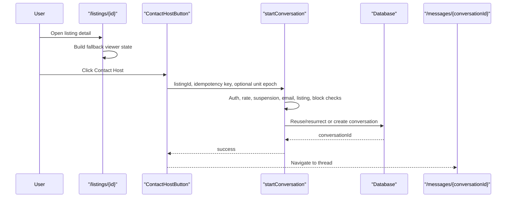
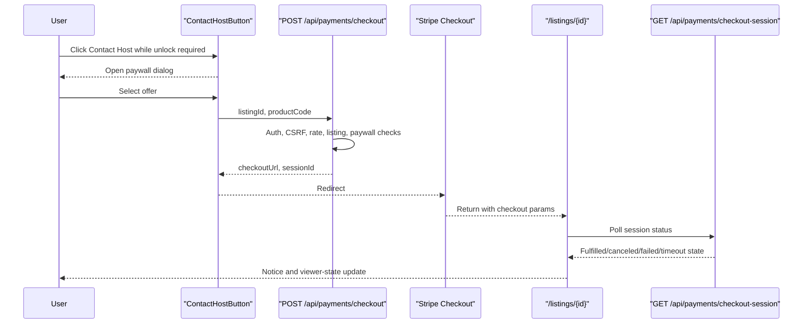
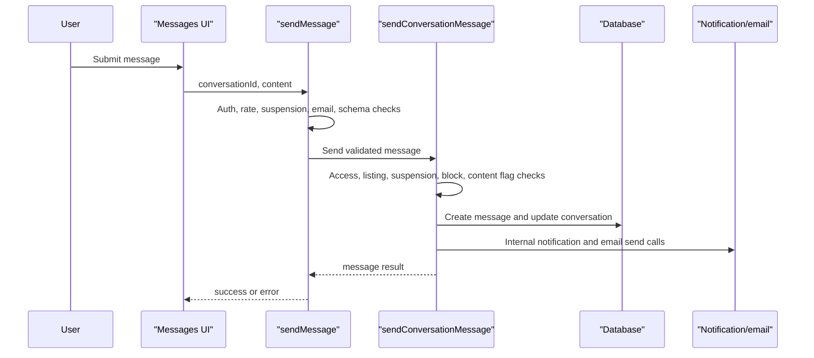
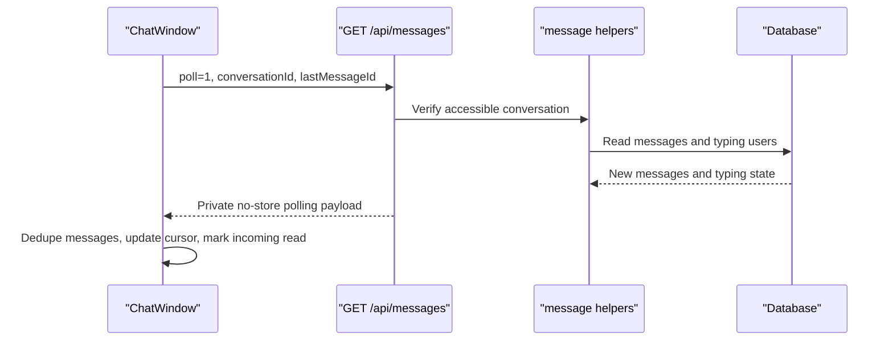

# Runtime Sequences

These diagrams represent source-observed flow and cite later focused runtime
evidence where available. Contact button, `/api/messages`, listing
contactability, focused Chromium listing-detail, Chromium messaging, Mobile
Chrome no-deps messaging, and setup-backed Mobile Chrome messaging checks pass.
Mocked checkout browser return and paywall/unavailable/migration/moderation
listing-detail states also pass, CH-E063 adds focused WebKit/Mobile
Chrome/Mobile Safari listing-detail plus messaging passes, CH-E064 confirms
Firefox browser availability and reproduces focused Firefox test/setup failures,
and CH-E065 passes the focused Firefox listing-detail and messaging specs after
narrow test/helper fixes. CH-E068 implements suspended/blocked listing-detail
pre-click contract, UI, fixture, and focused test source; CH-E073 closes the
historical CH-E068 execution gap with focused four-state Chromium proof and a
full listing-detail Contact Host Chromium spec rerun. Provider-level Supabase
realtime/RLS remains the only current Contact Host P1; email delivery and real
provider fulfillment remain P2 confidence gaps.

## Primary Contact Flow

Evidence: CH-E001-CH-E011, CH-E032, CH-E034, CH-E040, CH-E045.

## Paywall Unlock Flow

Runtime status: partially runtime verified. Source and component handoff
evidence are documented, checkout-session route/status tests passed, and CH-E058
verified mocked Chromium checkout return / paid-unlock runtime. Real Stripe
redirect and webhook/provider fulfillment remain not verified.

Evidence: CH-E004, CH-E010; `phase-4/02-api-data-flow.md`.

## Message Send Flow

Evidence: CH-E012-CH-E014, CH-E032, CH-E034, CH-E038, CH-E040.

## Polling / Read Flow

Evidence: CH-E015, CH-E016, CH-E032; `phase-4/01-ui-interaction-census.md`.
