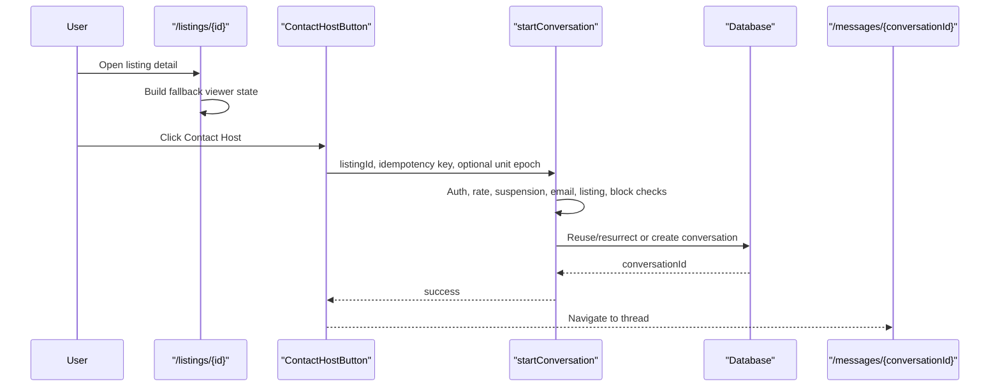
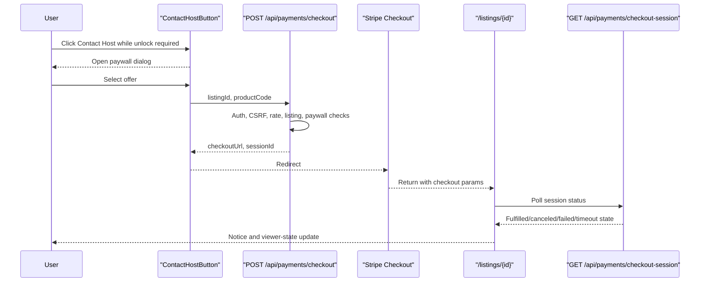
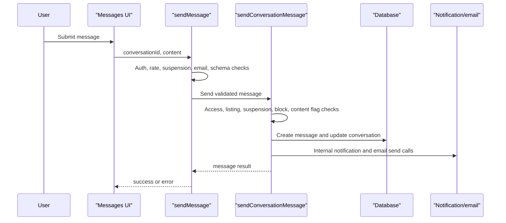
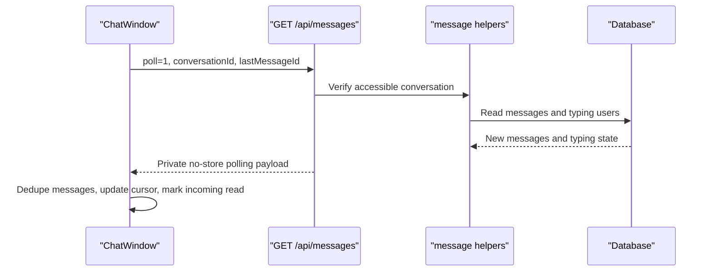

# Runtime Sequences

These diagrams represent source-observed flow and cite later focused runtime
evidence where available. Contact button, `/api/messages`, listing
contactability, focused Chromium listing-detail, Chromium messaging, Mobile
Chrome no-deps messaging, setup-backed Mobile Chrome messaging, and P1 unit/API
follow-up checks pass. Checkout browser return, realtime/RLS, actual email delivery,
suspended/paywall/unavailable listing states, and the full browser matrix remain
gaps.

## Primary Contact Flow

Evidence: CH-E001-CH-E011, CH-E032, CH-E034, CH-E040, CH-E045.

## Paywall Unlock Flow

Runtime status: NOT RUNTIME VERIFIED for Stripe checkout execution, checkout
return, and checkout-session polling. Source and component handoff evidence are
documented, but the paid unlock browser/API flow still needs focused runtime
verification.

Evidence: CH-E004, CH-E010; `phase-4/02-api-data-flow.md`.

## Message Send Flow

Evidence: CH-E012-CH-E014, CH-E032, CH-E034, CH-E038, CH-E040.

## Polling / Read Flow

Evidence: CH-E015, CH-E016, CH-E032; `phase-4/01-ui-interaction-census.md`.
