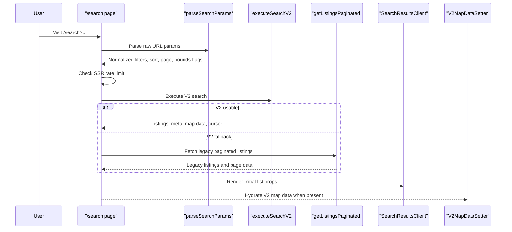
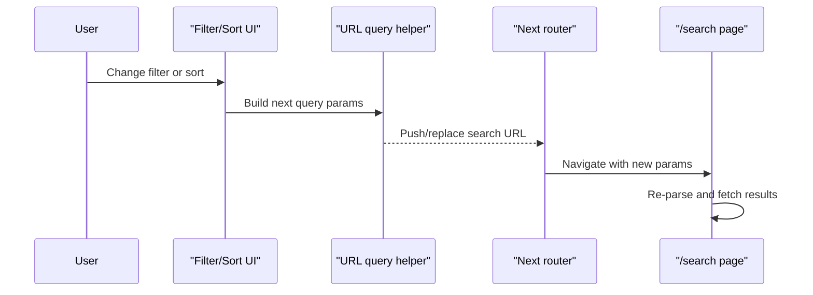
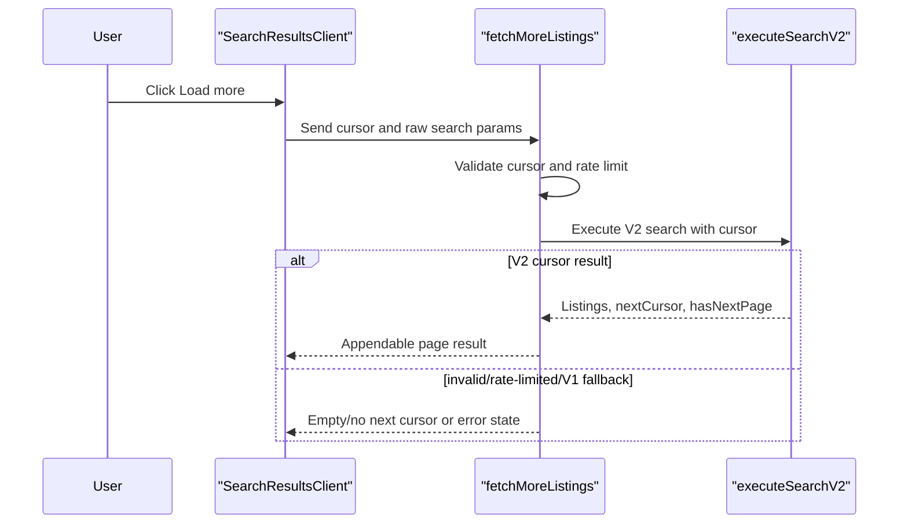
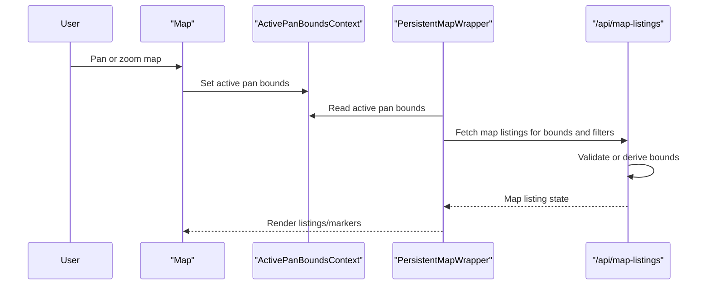
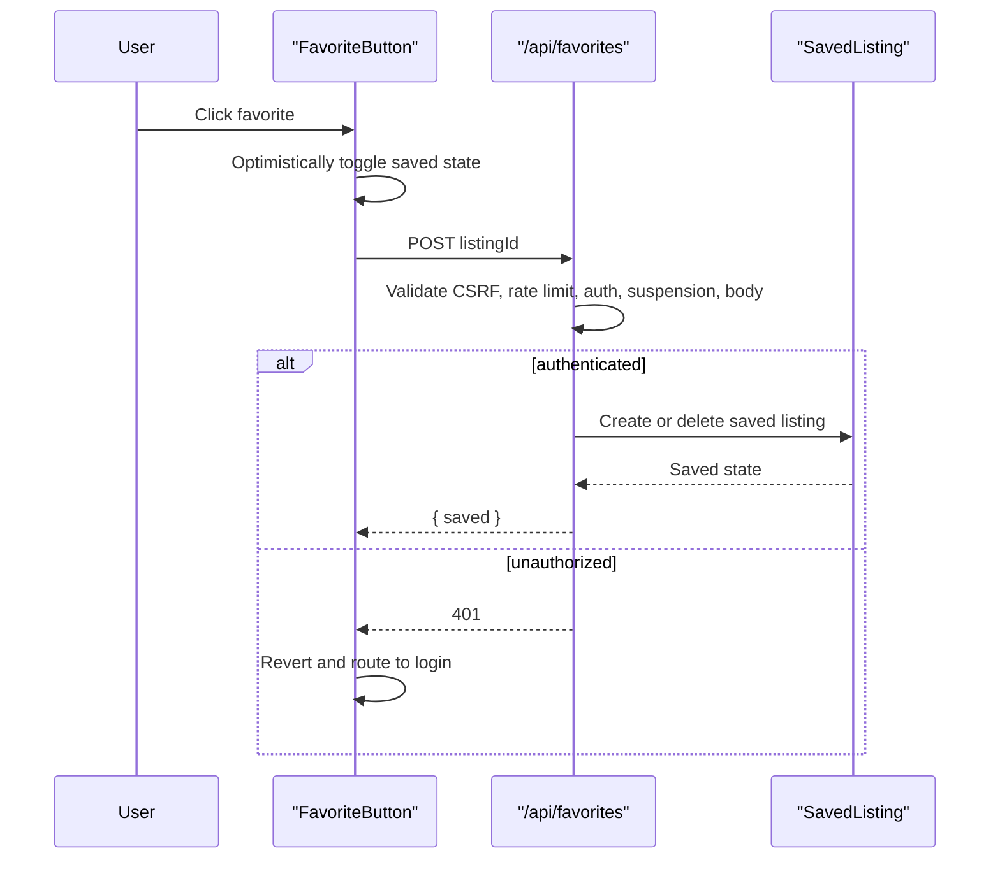
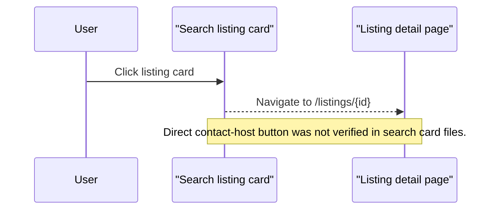

# Runtime Sequences

These are code-evidence sequences with Phase 10 runtime evidence called out where it exists. Focused smoke, filter/URL, sort/load-more, desktop map, results-state, URL-state, saved-listing, mobile map/list, search error-resilience, map error/a11y, focused API/unit, release-gate, and captured public-payload PII checks have passed. V1-only map API mock cases and broader non-gate E2E coverage remain gaps.

## Primary Search Load

Evidence: `evidence-register.md` C001-C007, C034, C045, C047.

## Filter Or Sort Change

Evidence: `src/components/SearchForm.tsx`:L733-L863; `src/components/SortSelect.tsx`:L61-L76; `phase-4/01-ui-interaction-census.md`; `runtime-verification.md`. Phase 10 verified desktop sort/load-more reset behavior, while bounds and broader reset coverage remain incomplete (`unknowns.md` G006).

## Pagination

Evidence: `src/components/search/SearchResultsClient.tsx`:L710-L872; `src/app/search/actions.ts`:L48-L300; `runtime-verification.md`; `evidence-register.md` C036.

## Map Bounds / Marker Fetch

Evidence: `src/components/Map.tsx`:L3614-L3650; `src/contexts/ActivePanBoundsContext.tsx`:L52-L68; `src/components/PersistentMapWrapper.tsx`:L382-L430; `src/app/api/map-listings/route.ts`:L230-L397; `runtime-verification.md`; `evidence-register.md` C037, C041, C043, C056. C056 verifies the focused desktop list-backed map parity path. V1-only map API mock cases and broader non-gate map/list synchronization coverage remain gaps.

## Save Listing

Evidence: `src/components/FavoriteButton.tsx`:L43-L87; `src/app/api/favorites/route.ts`:L73-L171; `runtime-verification.md`; `evidence-register.md` C040, C044, C045.

## Contact Host Entry

Evidence: `src/components/listings/ListingCard.tsx`:L349-L352, L492-L499; `evidence-register.md` C029.
