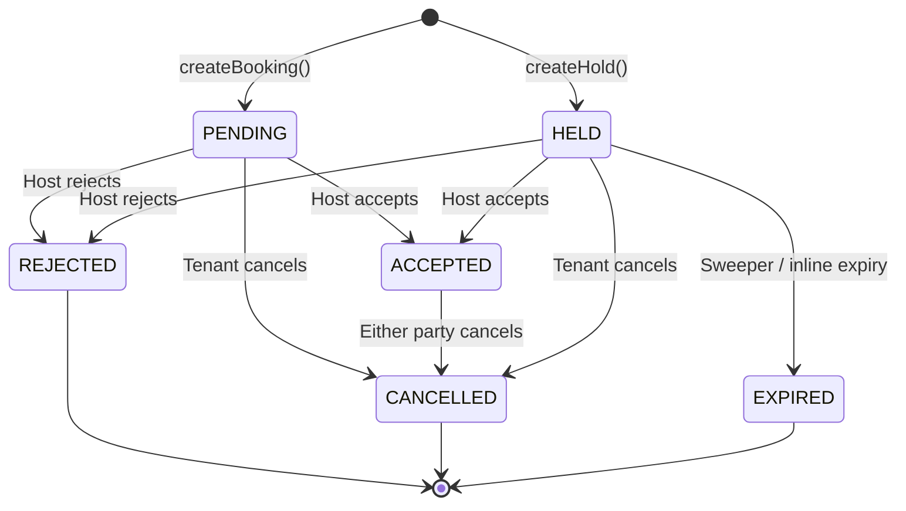

# Codebase Discovery: Multi-Slot & Whole-Room Booking System

> **Version**: 1.0 | **Date**: 2026-03-13 | **Status**: Verified against source code

---

## 1. Executive Summary

RoomShare's booking system manages the lifecycle of reservation requests from tenants to hosts, supporting both per-slot and whole-unit booking modes. The system handles five booking states (PENDING, ACCEPTED, REJECTED, CANCELLED, HELD, EXPIRED) with a state machine, five layers of concurrency control, and comprehensive audit logging. All state transitions are validated server-side with pessimistic and optimistic locking, idempotency protection, and rate limiting.

This document exists as the authoritative reference for the booking system's architecture, invariants, and test coverage. Every claim is verified against source code with exact file paths and line numbers. No assumptions, no estimated values — all data comes from direct code reads and `wc -l` verification.

**How to use this document:**
- **New engineers**: Read Sections 2–5 for architecture context, then Section 7 (Invariant Registry) for the system's hard rules.
- **QA engineers**: Derive stability tests from Section 7 invariants and Section 9 slot accounting rules.
- **Production readiness audit**: Review Section 11 (Risk Register), Section 8 (Concurrency Model), and Section 10 (Test Coverage).

---

## 2. Architecture Evolution Timeline

The booking system evolved through 5 phases, each building on the previous:

| Phase | Name | Key Feature | Migration(s) | Key Design Decision |
|-------|------|-------------|--------------|---------------------|
| **P0** | Foundation | Listing.version, IdempotencyKey table, NotificationType extension | `20260101000000_phase0_idempotency_fix`, `20260310000000_phase0_listing_version_notification_types` | Idempotency-first: prevent double-bookings at infrastructure level |
| **P1** | Constraint | Slots constraint (totalSlots > 0, availableSlots bounds), optimistic locking | `20251203000000_add_slots_constraint`, `20260124000000_booking_version_optimistic_lock` | DB-level invariants: impossible states made impossible by CHECK constraints |
| **P2** | Multi-Slot | `slotsRequested` column (default 1), SUM-based capacity checks | `20260310000000_phase2_booking_slots_requested` | SUM-based capacity: count actual slot consumption, not booking count |
| **P3** | Whole-Unit | `booking_mode` TEXT, CHECK constraint, `check_whole_unit_overlap()` PL/pgSQL trigger | `20260310100000_phase3_whole_unit_booking_mode` (69 lines) | Defense-in-depth: DB trigger + app-level checks both enforce WHOLE_UNIT rules |
| **P4** | Soft Holds | HELD/EXPIRED enum values, `heldUntil`/`heldAt` columns, sweeper cron, advisory locks, partial unique index | `20260310200000_phase4_soft_holds` (17 lines), `20260310200001_phase4_soft_holds_indexes` (60 lines), `20260313000000_soft_holds_partial_unique_index` (33 lines) | Slots consumed on hold creation, not acceptance — prevents overbooking during hold window |

---

## 3. File Inventory

### 3.1 Core Source Files (18 files, 5,462 lines)

| File | Lines | Purpose |
|------|------:|---------|
| `src/app/actions/booking.ts` | 923 | `createBooking()` + `createHold()` server actions |
| `src/app/actions/manage-booking.ts` | 617 | `updateBookingStatus()` + `getMyBookings()` |
| `src/lib/booking-state-machine.ts` | 87 | `VALID_TRANSITIONS` map, `validateTransition()`, `canTransition()`, `isTerminalStatus()` |
| `src/lib/booking-audit.ts` | 64 | `logBookingAudit()` with PII stripping (`stripPii()`) |
| `src/lib/booking-utils.ts` | 46 | `getActiveBookingsForListing()`, `hasActiveAcceptedBookings()` |
| `src/lib/hold-constants.ts` | 10 | `HOLD_TTL_MINUTES=15`, `MAX_HOLDS_PER_USER=3`, `SWEEPER_BATCH_SIZE=100` |
| `src/lib/idempotency.ts` | 290 | `withIdempotency<T>()`: INSERT ON CONFLICT + FOR UPDATE + SHA-256 hash |
| `src/lib/rate-limit.ts` | 384 | DB-backed sliding window + degraded in-process fallback + fail-closed |
| `src/lib/schemas.ts` | 223 | `createBookingSchema` + `createHoldSchema` (Zod validation) |
| `src/lib/cron-auth.ts` | 33 | `validateCronAuth()` with CRON_SECRET bearer token |
| `src/app/api/cron/sweep-expired-holds/route.ts` | 221 | Advisory lock + FOR UPDATE SKIP LOCKED + batch expire |
| `src/app/api/cron/reconcile-slots/route.ts` | 156 | Weekly slot drift detection, auto-fix when delta ≤ 5 |
| `src/components/BookingForm.tsx` | 869 | Multi-mode booking/hold form with idempotency key generation |
| `src/components/bookings/HoldCountdown.tsx` | 89 | Real-time countdown timer with urgency colors |
| `src/components/SlotSelector.tsx` | 57 | Spinbutton for slot selection (ARIA accessible) |
| `src/components/listings/SlotBadge.tsx` | 59 | Availability badge ("N of M open") |
| `src/app/bookings/BookingsClient.tsx` | 668 | Bookings management page (sent/received tabs) |
| `src/app/listings/[id]/ListingPageClient.tsx` | 666 | Listing detail page, passes booking props to BookingForm |

### 3.2 Schema & Migrations

| Migration | SQL Lines | Purpose |
|-----------|----------:|---------|
| `prisma/schema.prisma` | 506 | Full schema: Booking, BookingAuditLog, Listing, IdempotencyKey, RateLimitEntry |
| `20251203000000_add_slots_constraint` | — | CHECK: `totalSlots > 0 AND availableSlots >= 0 AND availableSlots <= totalSlots` |
| `20260101000000_phase0_idempotency_fix` | — | IdempotencyKey table |
| `20260124000000_booking_version_optimistic_lock` | — | `version` column on Booking |
| `20260310000000_phase0_listing_version_notification_types` | — | Listing.version + extended NotificationType enum |
| `20260310000000_phase2_booking_slots_requested` | — | `slotsRequested` column (default 1) |
| `20260310100000_phase3_whole_unit_booking_mode` | 69 | `booking_mode` column, CHECK constraint, `check_whole_unit_overlap()` trigger |
| `20260310200000_phase4_soft_holds` | 17 | HELD/EXPIRED enum values + `heldUntil`/`heldAt` columns |
| `20260310200001_phase4_soft_holds_indexes` | 60 | Composite indexes + updated WHOLE_UNIT trigger to include HELD |
| `20260313000000_soft_holds_partial_unique_index` | 33 | Partial unique index, ghost-hold index, sweeper index |

### 3.3 Unit/Integration Tests (19 files, 8,162 lines)

| File | Lines | Coverage |
|------|------:|----------|
| `src/__tests__/actions/booking.test.ts` | 404 | createBooking: auth, validation, duplicate, price, capacity |
| `src/__tests__/actions/booking-hold.test.ts` | 767 | createHold: max holds, capacity, duplicate, slot decrement |
| `src/__tests__/actions/booking-rate-limit.test.ts` | 221 | Rate limiting for booking and hold creation |
| `src/__tests__/actions/booking-slots-validation.test.ts` | 310 | Multi-slot capacity, SUM-based validation |
| `src/__tests__/actions/booking-whole-unit.test.ts` | 421 | WHOLE_UNIT mode override, trigger handling |
| `src/__tests__/actions/manage-booking.test.ts` | 997 | Accept/reject/cancel, slot restore, notifications |
| `src/__tests__/actions/manage-booking-hold.test.ts` | 664 | HELD→ACCEPTED, HELD→REJECTED, HELD→CANCELLED, inline expiry |
| `src/__tests__/actions/manage-booking-whole-unit.test.ts` | 528 | WHOLE_UNIT accept/reject/cancel |
| `src/__tests__/lib/booking-state-machine.test.ts` | 328 | All 6 states, all valid/invalid transitions |
| `src/__tests__/lib/booking-audit.test.ts` | 206 | PII stripping, audit creation, feature flag gating |
| `src/__tests__/lib/booking-utils.test.ts` | 225 | Active booking queries |
| `src/__tests__/lib/listing-availability.test.ts` | 66 | Slot reconciliation |
| `src/__tests__/api/bookings/audit.test.ts` | 203 | Audit trail API route |
| `src/__tests__/api/cron/sweep-expired-holds.test.ts` | 451 | Sweeper: advisory lock, batch expire, restore, notify |
| `src/__tests__/api/cron/reconcile-slots.test.ts` | 183 | Drift detection, auto-fix, Sentry |
| `src/__tests__/booking/idempotency.test.ts` | 431 | Duplicate submission, hash mismatch |
| `src/__tests__/booking/race-condition.test.ts` | 529 | Concurrent booking attempts |
| `src/__tests__/booking/whole-unit-concurrent.test.ts` | 307 | WHOLE_UNIT concurrency |
| `src/__tests__/edge-cases/bookings-edge-cases.test.ts` | 921 | Blocked users, price changes, edge cases |

### 3.4 Component Tests (4 files, 494 lines)

| File | Lines | Coverage |
|------|------:|----------|
| `src/__tests__/components/BookingForm.test.tsx` | 226 | Form rendering, date validation, submit |
| `src/__tests__/components/SlotSelector.test.tsx` | 74 | Increment/decrement, ARIA |
| `src/__tests__/components/SlotBadge.test.tsx` | 99 | Label/variant rendering |
| `src/__tests__/components/HoldCountdown.test.tsx` | 95 | Countdown, expiry callback, urgency |

### 3.5 E2E Tests (4 specs + 1 helper, 1,713 lines)

| File | Lines | Coverage |
|------|------:|----------|
| `tests/e2e/journeys/05-booking.spec.ts` | 336 | Basic booking journeys |
| `tests/e2e/journeys/21-booking-lifecycle.spec.ts` | 352 | Full lifecycle: submit, reject, cancel, duplicate prevention |
| `tests/e2e/booking/booking-race-conditions.spec.ts` | 748 | RC-01 through RC-09: concurrent booking, double-click, idempotency |
| `tests/e2e/mobile/mobile-bookings.spec.ts` | 243 | Mobile-specific booking flows |
| `tests/e2e/helpers/booking-helpers.ts` | 34 | Shared E2E helper |

### 3.6 Test Coverage Summary

| Category | Files | Lines |
|----------|------:|------:|
| Unit/Integration tests | 19 | 8,162 |
| Component tests | 4 | 494 |
| E2E tests (specs + helper) | 5 | 1,713 |
| **Total** | **28** | **10,369** |

---

## 4. State Machine

### 4.1 State Diagram



### 4.2 Transition Table

Verified from `booking-state-machine.ts:13-20`:

```typescript
VALID_TRANSITIONS = {
  PENDING:   ['ACCEPTED', 'REJECTED', 'CANCELLED'],
  ACCEPTED:  ['CANCELLED'],
  REJECTED:  [],      // Terminal
  CANCELLED: [],      // Terminal
  HELD:      ['ACCEPTED', 'REJECTED', 'CANCELLED', 'EXPIRED'],
  EXPIRED:   [],      // Terminal
}
```

### 4.3 Transition Detail

| From | To | Actor | Slot Effect | Lock Type | Code Location |
|------|----|-------|-------------|-----------|---------------|
| — | PENDING | Tenant | No change | Pessimistic (FOR UPDATE) + Serializable | `booking.ts:317-486` |
| — | HELD | Tenant | −slotsRequested | Pessimistic + Serializable | `booking.ts:756-923` |
| PENDING | ACCEPTED | Host | −slotsRequested | Pessimistic + Optimistic (version) | `manage-booking.ts:197-262` |
| PENDING | REJECTED | Host | No change | Optimistic (version) | `manage-booking.ts:330-380` |
| PENDING | CANCELLED | Tenant | No change | Optimistic (version) | `manage-booking.ts:486-524` |
| HELD | ACCEPTED | Host | No change (already consumed) | Pessimistic + Optimistic | `manage-booking.ts:135-175` |
| HELD | REJECTED | Host | +slotsRequested (LEAST clamp) | Pessimistic + Optimistic | `manage-booking.ts:330-370` |
| HELD | CANCELLED | Tenant/Host | +slotsRequested (LEAST clamp) | Pessimistic + Optimistic | `manage-booking.ts:430-470` |
| HELD | EXPIRED | System (sweeper) | +slotsRequested (LEAST clamp) | Advisory + FOR UPDATE SKIP LOCKED | `sweep-expired-holds/route.ts:58-137` |
| ACCEPTED | CANCELLED | Either | +slotsRequested (LEAST clamp) | Pessimistic + Optimistic | `manage-booking.ts:430-470` |

---

## 5. API Endpoint Catalog

### 5.1 Server Actions

| Action | Auth Requirements | Rate Limits | Idempotency |
|--------|------------------|-------------|-------------|
| `createBooking()` | Session + email verified + not suspended | 10/hr per user, 30/hr per IP | Optional (idempotencyKey param) |
| `createHold()` | Session + email verified + not suspended | 10/hr per user, 30/hr per IP, 3/hr per user+listing | Optional (idempotencyKey param) |
| `updateBookingStatus()` | Session + not suspended + role-based (host for accept/reject, tenant for cancel) | 30/min per user | No |
| `getMyBookings()` | Session | None | No |

### 5.2 Cron Routes

| Endpoint | Auth | Schedule | Purpose |
|----------|------|----------|---------|
| `GET /api/cron/sweep-expired-holds` | CRON_SECRET bearer token | Every 1-2 min | Expire HELD bookings past heldUntil, restore slots |
| `GET /api/cron/reconcile-slots` | CRON_SECRET bearer token | Weekly (Sun 5 AM UTC) | Detect and auto-fix slot drift (delta ≤ 5) |

### 5.3 API Routes

| Endpoint | Auth | Purpose |
|----------|------|---------|
| `GET /api/bookings/[id]/audit` | Session (tenant, host, or admin) | Audit trail retrieval |

---

## 6. Data Flow Diagrams

### 6.1 createBooking Flow

Verified from `booking.ts:317-486`:

```
Request
  │
  ├─ auth check (session required)
  ├─ suspension check (user not suspended)
  ├─ email verification check
  ├─ rate limit: user (10/hr) + IP (30/hr)
  ├─ Zod validation (createBookingSchema)
  ├─ feature flag check (multiSlotBooking)
  │
  └─ withIdempotency wrapper (if key provided)
      │
      └─ $transaction (isolationLevel: Serializable)
          │
          ├─ duplicate check: existing PENDING/ACCEPTED/HELD for same tenant+listing+dates
          ├─ FOR UPDATE on Listing (pessimistic lock)
          ├─ price validation: Math.abs(clientPrice - dbPrice) > 0.01 → reject
          ├─ blocked user check (isBlocked relation)
          ├─ WHOLE_UNIT override: effectiveSlotsRequested = listing.totalSlots
          ├─ SUM capacity check: WHERE status = 'ACCEPTED' only
          │   (PENDING does NOT consume slots)
          ├─ user overlap check: same tenant, overlapping dates, active status
          ├─ CREATE Booking (status: PENDING) — NO slot decrement
          └─ logBookingAudit() inside TX
      │
      └─ Post-TX side effects:
          ├─ createNotification (BOOKING_REQUEST)
          ├─ sendEmail (to host)
          └─ revalidatePath
```

### 6.2 createHold Flow

Verified from `booking.ts:756-923`:

```
Request
  │
  ├─ auth check
  ├─ rate limit: user (10/hr) + IP (30/hr) + per-listing (3/hr per user+listing)
  ├─ suspension check
  ├─ email verification check
  ├─ feature flag: softHoldsEnabled must be "on"
  ├─ Zod validation (createHoldSchema)
  ├─ multi-slot feature flag check
  │
  └─ withIdempotency wrapper (if key provided)
      │
      └─ $transaction (isolationLevel: Serializable)
          │
          ├─ MAX_HOLDS_PER_USER check: COUNT WHERE status='HELD' AND heldUntil > NOW()
          ├─ FOR UPDATE on Listing
          ├─ price validation: Math.abs(clientPrice - dbPrice) > 0.01
          ├─ blocked user check
          ├─ WHOLE_UNIT override: effectiveSlotsRequested = listing.totalSlots
          ├─ SUM capacity check: WHERE status = 'ACCEPTED' OR (status = 'HELD' AND heldUntil > NOW())
          │   (HELD slots are counted in capacity)
          ├─ duplicate check: including HELD with heldUntil > NOW()
          ├─ UPDATE Listing: availableSlots -= slotsRequested (conditional decrement)
          ├─ CREATE Booking (status: HELD, heldUntil: NOW() + 15min)
          └─ logBookingAudit() inside TX
      │
      └─ Post-TX side effects:
          ├─ createNotification (HOLD_PLACED)
          └─ revalidatePath
```

### 6.3 updateBookingStatus: ACCEPT Flow

Verified from `manage-booking.ts:124-301`:

```
Two sub-paths depending on current status:

─── PENDING → ACCEPTED ───
  │
  ├─ FOR UPDATE on Listing
  ├─ Re-verify host ownership (TOCTOU protection)
  ├─ WHOLE_UNIT override
  ├─ SUM capacity: WHERE (ACCEPTED OR (HELD AND heldUntil > NOW())) AND id != bookingId
  ├─ Optimistic version check (Booking.version)
  ├─ UPDATE Listing: availableSlots -= slotsRequested (conditional decrement)
  ├─ UPDATE Booking: status=ACCEPTED, version+1
  └─ logBookingAudit()

─── HELD → ACCEPTED ───
  │
  ├─ FOR UPDATE on Listing
  ├─ Verify heldUntil > NOW() (inline expiry if not)
  ├─ Re-verify host ownership
  ├─ Optimistic version check
  ├─ NO slot decrement (slots already consumed at hold time — D4 design decision)
  ├─ UPDATE Booking: status=ACCEPTED, heldUntil=NULL, version+1
  └─ logBookingAudit()
```

### 6.4 updateBookingStatus: CANCEL Flow

Verified from `manage-booking.ts:434-524`:

```
Two sub-paths depending on current status:

─── From ACCEPTED or HELD ───
  │
  ├─ FOR UPDATE on Listing
  ├─ Optimistic version check
  ├─ UPDATE Listing: availableSlots = LEAST(availableSlots + slotsRequested, totalSlots)
  ├─ Clear heldUntil (if HELD)
  ├─ UPDATE Booking: status=CANCELLED, version+1
  └─ logBookingAudit()

─── From PENDING ───
  │
  ├─ Optimistic version check only (no Listing lock needed)
  ├─ No slot change (PENDING never consumed slots)
  ├─ UPDATE Booking: status=CANCELLED, version+1
  └─ logBookingAudit()
```

### 6.5 Sweeper (Expired Hold Cleanup)

Verified from `sweep-expired-holds/route.ts:39-221`:

```
GET /api/cron/sweep-expired-holds
  │
  ├─ validateCronAuth() — CRON_SECRET bearer token
  ├─ Feature flag check: softHoldsEnabled must be "on" or "drain"
  │
  └─ $transaction
      │
      ├─ pg_try_advisory_xact_lock(hashtext('sweeper-expire-holds'))
      │   └─ If not acquired → return { skipped: true, reason: "lock_held" }
      │
      ├─ SELECT WHERE status='HELD' AND heldUntil <= NOW()
      │   FOR UPDATE OF b SKIP LOCKED
      │   LIMIT 100 (SWEEPER_BATCH_SIZE)
      │
      └─ For each expired hold:
          ├─ UPDATE Booking: status=EXPIRED, heldUntil=NULL, version+1
          ├─ UPDATE Listing: availableSlots = LEAST(availableSlots + slotsRequested, totalSlots)
          └─ logBookingAudit() (action: EXPIRED, actorType: SYSTEM)
      │
      └─ Post-TX:
          ├─ Notifications to tenant + host for each expired hold
          └─ markListingsDirty (cache invalidation)
```

---

## 7. Invariant Registry

Every invariant is verified against specific source code locations.

| # | Invariant | Enforcement | Source Location |
|---|-----------|-------------|-----------------|
| **INV-01** | ACCEPTED + active HELD slots ≤ totalSlots | FOR UPDATE + SUM query inside TX | `booking.ts:161-177` (createBooking), `booking.ts:602-613` (createHold), `manage-booking.ts:217-228` (accept) |
| **INV-02** | availableSlots accuracy | Atomic decrement/restore + LEAST clamp + weekly reconciler | `booking.ts:655-663`, `manage-booking.ts:254-262`, `sweep-expired-holds/route.ts:119-123` |
| **INV-03** | Idempotency: same key + same body = cached result | INSERT ON CONFLICT + SHA-256 hash + FOR UPDATE | `idempotency.ts:131-146` (claim), `idempotency.ts:186-192` (hash check), `idempotency.ts:197-206` (cached return) |
| **INV-04** | Idempotency: same key + different body = 400 error | SHA-256 hash comparison before returning cached result | `idempotency.ts:186-192` |
| **INV-05** | State machine: only VALID_TRANSITIONS allowed | `validateTransition()` called before any status UPDATE | `manage-booking.ts:110-121`, `booking-state-machine.ts:34-38` |
| **INV-06** | Price authority: DB price is source of truth | `Math.abs(clientPrice - dbPrice) > 0.01` rejection | `booking.ts:107-114`, `booking.ts:561-569` |
| **INV-07** | Hold expiration: sweeper = primary, inline = secondary | Sweeper cron runs every 1-2min; inline check in updateBookingStatus | `sweep-expired-holds/route.ts:58-137`, `manage-booking.ts:82-107` |
| **INV-08** | Audit immutability: all transitions logged | `logBookingAudit()` called inside TX for every status change | `booking-audit.ts:36-64` |
| **INV-09** | TOCTOU protection: pessimistic + optimistic locking | FOR UPDATE on Listing + version column on Booking | `booking.ts:83-97`, `manage-booking.ts:146-151` |
| **INV-10** | Fail-closed rate limiting | Catch block returns "deny" + degraded in-process Map fallback | `rate-limit.ts:182-207` |
| **INV-11** | PENDING does NOT consume slots | No availableSlots decrement in createBooking | `booking.ts:214-225` (Booking.create only, no Listing UPDATE) |
| **INV-12** | HELD consumes slots immediately | Conditional UPDATE availableSlots in createHold TX | `booking.ts:655-663` |
| **INV-13** | HELD→ACCEPTED: no additional slot consumption | Design decision D4 — slots already consumed at hold time | `manage-booking.ts:173` (comment: "NO slot decrement — D4") |
| **INV-14** | Slot restore uses LEAST clamp | `LEAST(availableSlots + N, totalSlots)` prevents exceeding total | `manage-booking.ts:366-370`, `manage-booking.ts:461-465`, `sweep-expired-holds/route.ts:119-123` |
| **INV-15** | MAX_HOLDS_PER_USER = 3 | COUNT query in createHold TX | `booking.ts:522-535`, `hold-constants.ts:4` |
| **INV-16** | WHOLE_UNIT forces slotsRequested = totalSlots | `effectiveSlotsRequested = listing.totalSlots` override | `booking.ts:155-157`, `booking.ts:597-599` |
| **INV-17** | WHOLE_UNIT overlap prevention trigger | PL/pgSQL `check_whole_unit_overlap()` on INSERT OR UPDATE | Migration `20260310200001` lines 19-52 (updated to include HELD status) |
| **INV-18** | Partial unique index allows re-application after rejection | `WHERE status IN ('PENDING','HELD','ACCEPTED')` — REJECTED/CANCELLED/EXPIRED excluded | Migration `20260313000000` lines 21-23 |
| **INV-19** | No PII in audit logs | `stripPii()` removes email/phone/name/address keys | `booking-audit.ts:16-29` |
| **INV-20** | Manual EXPIRED transition blocked | Guard: `if (status === 'EXPIRED')` returns error | `manage-booking.ts:39-41` |
| **INV-21** | Sweeper advisory lock mutex | `pg_try_advisory_xact_lock(hashtext('sweeper-expire-holds'))` | `sweep-expired-holds/route.ts:60-66` |
| **INV-22** | Serialization retry (max 3 attempts) | P2034 error detection + exponential backoff | `booking.ts:466-474` (50ms * attempt), `idempotency.ts:240-256` (50 * 2^attempt) |

---

## 8. Concurrency Model (5 Layers)

### Layer 1: Pessimistic Locking (FOR UPDATE)

Prevents concurrent reads from seeing stale Listing data during slot operations.

| Location | Target | Purpose |
|----------|--------|---------|
| `booking.ts:83-97` | Listing row | createBooking capacity check |
| `booking.ts:538-554` | Listing row | createHold capacity check |
| `manage-booking.ts:135-139` | Listing row | HELD→ACCEPTED (verify hold still valid) |
| `manage-booking.ts:197-201` | Listing row | PENDING→ACCEPTED (capacity re-check) |
| `manage-booking.ts:336-340` | Listing row | REJECT (slot restore for HELD) |
| `manage-booking.ts:440` | Listing row | CANCEL (slot restore for ACCEPTED/HELD) |

### Layer 2: Optimistic Locking (version column)

Detects conflicting concurrent updates to the same Booking row.

| Location | Check |
|----------|-------|
| `manage-booking.ts:146-157` | HELD→ACCEPTED version match |
| `manage-booking.ts:236-245` | PENDING→ACCEPTED version match |
| `manage-booking.ts:346-357` | REJECTED version match |
| `manage-booking.ts:442-452` | CANCELLED version match |

### Layer 3: Serializable Isolation Level

Prevents phantom reads during capacity SUM queries.

| Location | Scope |
|----------|-------|
| `booking.ts:442` | createBooking transaction |
| `booking.ts:876-878` | createHold transaction |
| `idempotency.ts:234` | withIdempotency wrapper transaction |

### Layer 4: Advisory Locks

Prevents concurrent cron instances from processing the same data.

| Location | Lock Key | Purpose |
|----------|----------|---------|
| `sweep-expired-holds/route.ts:60-62` | `sweeper-expire-holds` | Only one sweeper runs at a time |
| `reconcile-slots/route.ts:44-46` | `reconcile-slots` | Only one reconciler runs at a time |

### Layer 5: Idempotency Keys

Prevents duplicate operations from concurrent or retried requests.

| Location | Mechanism |
|----------|-----------|
| `idempotency.ts:131-146` | INSERT ON CONFLICT (userId, endpoint, key) — atomic claim |
| `idempotency.ts:153-167` | FOR UPDATE on claimed key — serialized access |

---

## 9. Slot Accounting Rules

### 9.1 Consumption Matrix

| Transition | Slot Effect | Code Location |
|------------|-------------|---------------|
| (none) → PENDING | No change | `booking.ts:214-225` |
| (none) → HELD | −slotsRequested | `booking.ts:655-663` |
| PENDING → ACCEPTED | −slotsRequested | `manage-booking.ts:254-262` |
| HELD → ACCEPTED | No change (D4) | `manage-booking.ts:173` |
| PENDING → REJECTED | No change | No slot code in reject path for PENDING |
| HELD → REJECTED | +slotsRequested (LEAST) | `manage-booking.ts:364-370` |
| PENDING → CANCELLED | No change | `manage-booking.ts:486-524` (no slot logic) |
| ACCEPTED → CANCELLED | +slotsRequested (LEAST) | `manage-booking.ts:459-465` |
| HELD → CANCELLED | +slotsRequested (LEAST) | `manage-booking.ts:459-465` |
| HELD → EXPIRED | +slotsRequested (LEAST) | `sweep-expired-holds/route.ts:119-123` |

### 9.2 Capacity Check Differences

The SUM query used for capacity checks differs by operation:

| Operation | SUM Filter | Why |
|-----------|-----------|-----|
| `createBooking` (→ PENDING) | `status = 'ACCEPTED'` only | PENDING doesn't consume slots, so only count ACCEPTED. Source: `booking.ts:161-168` |
| `createHold` (→ HELD) | `status = 'ACCEPTED' OR (status = 'HELD' AND heldUntil > NOW())` | HELD consumes slots, so count both ACCEPTED and active HELD. Source: `booking.ts:602-612` |
| `updateBookingStatus` ACCEPT | `(ACCEPTED OR (HELD AND heldUntil > NOW())) AND id != bookingId` | Excludes self from count. For HELD→ACCEPTED, self's slots are already counted. Source: `manage-booking.ts:217-228` |

### 9.3 Design Decision D4: Why HELD→ACCEPTED Has No Slot Change

When a HELD booking is accepted, the slots were already decremented at hold creation time (INV-12). Decrementing again would double-count. The capacity check at acceptance time (which excludes self via `id != bookingId`) verifies there's still room for other bookings, but the accepting booking's slots are already reflected in `availableSlots`.

---

## 10. Current Test Coverage

### 10.1 Coverage by System Area

| Area | Test Files | Lines | Confidence |
|------|-----------|------:|------------|
| State machine transitions | `booking-state-machine.test.ts` | 328 | HIGH — all 6 states, all valid/invalid transitions |
| Booking creation (PENDING) | `booking.test.ts`, `booking-slots-validation.test.ts`, `booking-whole-unit.test.ts` | 1,135 | HIGH — auth, validation, capacity, price, duplicates |
| Hold creation (HELD) | `booking-hold.test.ts` | 767 | HIGH — max holds, capacity, slot decrement |
| Status transitions (manage) | `manage-booking.test.ts`, `manage-booking-hold.test.ts`, `manage-booking-whole-unit.test.ts` | 2,189 | HIGH — accept/reject/cancel for all modes |
| Idempotency | `idempotency.test.ts` | 431 | HIGH — duplicate submission, hash mismatch, concurrent claims |
| Race conditions | `race-condition.test.ts`, `whole-unit-concurrent.test.ts` | 836 | MEDIUM — mocked concurrency (not true parallel) |
| Rate limiting | `booking-rate-limit.test.ts` | 221 | MEDIUM — unit-level; no integration with real DB sliding window |
| Audit logging | `booking-audit.test.ts`, `audit.test.ts` | 409 | HIGH — PII stripping, feature flag gating |
| Sweeper cron | `sweep-expired-holds.test.ts` | 451 | HIGH — advisory lock, batch expire, slot restore |
| Reconciler cron | `reconcile-slots.test.ts` | 183 | MEDIUM — drift detection, auto-fix |
| Edge cases | `bookings-edge-cases.test.ts` | 921 | HIGH — blocked users, price changes, boundary conditions |
| UI components | 4 component test files | 494 | MEDIUM — rendering, ARIA, interactions |
| E2E journeys | 4 spec files | 1,679 | HIGH — full lifecycle, race conditions, mobile |

### 10.2 Coverage Gaps

| Gap | Risk | Mitigation |
|-----|------|------------|
| True parallel race conditions (not mocked) | MEDIUM | E2E race condition specs (RC-01–RC-09) provide some coverage |
| Rate limit DB sliding window integration | LOW | Fail-closed design limits blast radius |
| Multi-browser concurrent holds E2E | MEDIUM | Unit tests cover logic; DB constraints are last line of defense |
| Sweeper + inline expiry interaction under load | LOW | SKIP LOCKED + version check + LEAST clamp prevent double-restore |

---

## 11. Risk Register

| # | Risk | Severity | Likelihood | Mitigation | Status |
|---|------|----------|------------|------------|--------|
| **R-01** | Sweeper cron stops running | HIGH | LOW | Event logging `sweep_expired_holds_complete`; inline expiry in `updateBookingStatus` as defense-in-depth (`manage-booking.ts:82-107`) | Mitigated |
| **R-02** | Clock skew between app server and DB | MEDIUM | LOW | All time comparisons use `NOW()` in SQL (DB time), never `new Date()` in app | Mitigated |
| **R-03** | Slot drift (availableSlots != actual) | MEDIUM | LOW | Reconciler cron (weekly); LEAST clamp on all restores; Sentry alert for delta > 5 | Mitigated |
| **R-04** | Rate limit DB outage | MEDIUM | LOW | In-process Map fallback (10 req/min hard limit); fail-closed on Map exhaustion (`rate-limit.ts:182-207`) | Mitigated |
| **R-05** | WHOLE_UNIT trigger bypass | LOW | VERY LOW | Defense-in-depth: PL/pgSQL trigger fires on INSERT OR UPDATE; app-level checks also enforce WHOLE_UNIT rules | Mitigated |
| **R-06** | Stale heldUntil displayed on client | LOW | MEDIUM | Inline expiry check in `updateBookingStatus`; HoldCountdown component shows "expired" state | Partially mitigated |
| **R-07** | IdempotencyKey table growth | LOW | LOW | 24hr expiry (`expiresAt`) on keys; no automated cleanup cron yet | Accepted |
| **R-08** | Notification failure masks booking success | LOW | LOW | Side effects run outside TX; errors caught and logged; booking state is source of truth | Accepted |
| **R-09** | Feature flag misconfiguration | MEDIUM | LOW | Zod `superRefine()` cross-validation: WHOLE_UNIT requires MULTI_SLOT; SOFT_HOLDS=on requires MULTI_SLOT; AUDIT requires SOFT_HOLDS=on (`env.ts:136-157`) | Mitigated |
| **R-10** | Sweeper + inline expiry double-restore | LOW | LOW | Sweeper uses SKIP LOCKED; inline uses version check; LEAST clamp prevents availableSlots > totalSlots | Mitigated |
| **R-11** | No notification backpressure | LOW | LOW | Fire-and-forget with try/catch; no retry queue; acceptable for MVP | Accepted |
| **R-12** | Client hold timer drift | LOW | MEDIUM | Timer uses server-provided `heldUntil`; bounded by 15min TTL; worst case: shows "expired" slightly late | Accepted |

---

## 12. Database Indexes

All booking-supporting indexes from schema and migrations:

| Index | Columns | Type | Source |
|-------|---------|------|--------|
| `Booking_listingId_status_idx` | (listingId, status) | B-tree | `schema.prisma` |
| `Booking_tenantId_idx` | (tenantId) | B-tree | `schema.prisma` |
| `Booking_listingId_status_startDate_endDate_idx` | (listingId, status, startDate, endDate) | B-tree | `schema.prisma` |
| `Booking_status_heldUntil_idx` | (status, heldUntil) | B-tree | `20260310200001_phase4_soft_holds_indexes` |
| `idx_booking_active_holds` | (listingId, heldUntil) WHERE status='HELD' | Partial B-tree | `20260310200001_phase4_soft_holds_indexes` |
| `idx_booking_active_unique` | (tenantId, listingId, startDate, endDate) WHERE status IN ('PENDING','HELD','ACCEPTED') | Partial unique | `20260313000000_soft_holds_partial_unique_index` |
| `idx_booking_held_by_listing` | (listingId, heldUntil) WHERE status='HELD' | Partial B-tree | `20260313000000_soft_holds_partial_unique_index` |
| `idx_booking_held_expiry` | (heldUntil) WHERE status='HELD' | Partial B-tree | `20260313000000_soft_holds_partial_unique_index` |
| BookingAuditLog: `bookingId` | (bookingId) | B-tree | `schema.prisma` |
| BookingAuditLog: `bookingId, createdAt` | (bookingId, createdAt) | B-tree | `schema.prisma` |
| BookingAuditLog: `actorId` | (actorId) | B-tree | `schema.prisma` |
| BookingAuditLog: `action` | (action) | B-tree | `schema.prisma` |
| BookingAuditLog: `createdAt` | (createdAt) | B-tree | `schema.prisma` |
| IdempotencyKey: unique | (userId, endpoint, key) | Unique | `schema.prisma` |

---

## 13. Glossary

| Term | Definition |
|------|-----------|
| **Booking** | A reservation request from a tenant for one or more slots in a listing, tracked through a lifecycle of states |
| **Hold (Soft Hold)** | A time-bounded reservation (default 15 minutes) that immediately consumes slots to prevent overbooking during the hold window |
| **Slot** | A single reservable unit within a listing. A listing with `totalSlots=4` can accommodate up to 4 concurrent bookings (in PER_SLOT mode) |
| **availableSlots** | Denormalized counter on the Listing row, decremented on hold/accept, restored on cancel/reject/expire. LEAST-clamped to prevent exceeding totalSlots |
| **totalSlots** | The maximum number of concurrent bookings a listing can accommodate. Immutable during active bookings |
| **WHOLE_UNIT mode** | Booking mode where the entire listing is reserved. Forces `slotsRequested = totalSlots` and uses a PL/pgSQL trigger to prevent overlapping reservations |
| **PER_SLOT mode** | Default booking mode. Multiple tenants can book individual slots concurrently, up to totalSlots |
| **Sweeper** | Cron job that runs every 1-2 minutes to expire HELD bookings past their `heldUntil` time. Uses advisory locks for mutual exclusion and FOR UPDATE SKIP LOCKED for row-level concurrency |
| **Reconciler** | Weekly cron job that detects and auto-corrects slot drift (when availableSlots diverges from the SUM-based ground truth). Auto-fixes deltas ≤ 5; alerts Sentry for larger deltas |
| **LEAST clamp** | Pattern `LEAST(availableSlots + N, totalSlots)` used in all slot restore operations to prevent availableSlots from exceeding totalSlots, even under concurrent execution |
| **D4 Design Decision** | The choice that HELD→ACCEPTED does not decrement slots, because they were already consumed at hold creation time |
| **Inline expiry** | Defense-in-depth mechanism in `updateBookingStatus` that checks heldUntil and auto-expires HELD bookings that the sweeper hasn't processed yet |
| **Advisory lock** | PostgreSQL `pg_try_advisory_xact_lock()` — a non-blocking, transaction-scoped mutex used by the sweeper and reconciler to prevent concurrent execution |
| **Idempotency key** | Client-generated UUID associated with a booking/hold request. Ensures retries produce the same result via INSERT ON CONFLICT + SHA-256 body hash comparison |
| **FOR UPDATE SKIP LOCKED** | PostgreSQL row-locking clause used by the sweeper. Locks rows for update while skipping any rows already locked by another transaction, preventing contention |

---

## 14. Feature Flag Dependency Chain

Verified from `src/lib/env.ts:105-157`:

```
ENABLE_MULTI_SLOT_BOOKING: "true" | "false" (default: not set = false)
    │
    ├── ENABLE_WHOLE_UNIT_MODE: "true" | "false"
    │   └── Requires: ENABLE_MULTI_SLOT_BOOKING = "true"
    │
    ├── ENABLE_SOFT_HOLDS: "on" | "drain" | "off"
    │   └── "on" requires: ENABLE_MULTI_SLOT_BOOKING = "true"
    │   └── "drain" mode: sweeper still runs, but new holds are blocked
    │
    └── ENABLE_BOOKING_AUDIT: "true" | "false"
        └── Requires: ENABLE_SOFT_HOLDS = "on"
```

Cross-validation is enforced by Zod `superRefine()` in `env.ts:136-157`. Invalid combinations cause startup-time validation errors with descriptive messages.

**Note on "drain" mode**: When `ENABLE_SOFT_HOLDS=drain`, the sweeper cron still processes existing HELD bookings (transitioning them to EXPIRED), but `createHold()` rejects new hold requests. This enables graceful wind-down of the soft holds feature.
